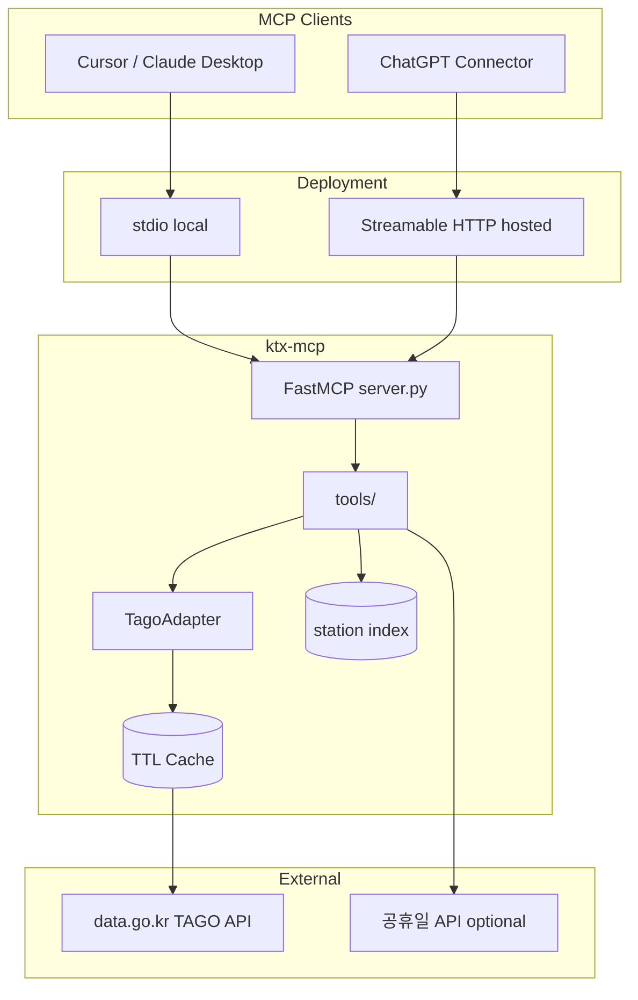

# ktx-mcp — 제품 SPEC & 상업 로드맵 (TAGO-only)

**문서 버전:** 1.2  
**작성일:** 2026-06-30  
**상태:** v8 5단계 확정 — **ktx-mcp (TAGO-only, 한국+글로벌 다국어, 저가·호출량)**  
**상업 전략:** **저가 진입 + 호출량 극대화** (가격보다 MAPI 월간 도구 호출 수)  
**프로젝트 가칭:** `ktx-mcp` / 패키지명 `ktx-mcp`  
**관련 조사:** [DEMAND_RESEARCH.md](./DEMAND_RESEARCH.md)

---

## 목차

1. [요약](#1-요약)
2. [법·라이선스 근거](#2-법라이선스-근거)
3. [제품 정의](#3-제품-정의)
4. [데이터 소스](#4-데이터-소스)
5. [Non-goals (하지 않는 것)](#5-non-goals-하지-않는-것)
6. [MCP 도구 스펙](#6-mcp-도구-스펙)
7. [응답·에러 규약](#7-응답에러-규약)
8. [기술 아키텍처](#8-기술-아키텍처)
9. [캐시·트래픽·운영](#9-캐시트래픽운영)
10. [배포 형태 (L1 MCP + L2 Skill)](#10-배포-형태-l1-mcp--l2-skill)
11. [상업 모델·가격 (저가 + 호출량)](#11-상업-모델가격-저가--호출량)
12. [다국어·글로벌 전략](#12-다국어글로벌-전략)
13. [12주 로드맵](#13-12주-로드맵)
14. [Go-to-Market](#14-go-to-market)
15. [리스크 레지스터](#15-리스크-레지스터)
16. [프로젝트 구조](#16-프로젝트-구조)
17. [환경 변수·설정](#17-환경-변수설정)
18. [테스트 계획](#18-테스트-계획)
19. [체크리스트 (출시 전)](#19-체크리스트-출시-전)

---

## 1. 요약

### 1.1 한 줄 포지션

> **「Ask in any language — get KTX/SRT schedules in one agent turn.」**  
> 한국 장거리 철도(KTX·SRT·ITX) 시각표 MCP. **한국어·영어·일본어·중국어** 등 자연어 입력·응답.  
> 데이터: **국토교통부 TAGO 공공데이터(이용허락 제한 없음)**.

### 1.2 왜 이 니치인가

| 근거 | 내용 |
|------|------|
| **시장 공백** | Registry `ktx`/`korail`/`srt` 0건; **다국어 장거리 철도 MCP** 없음 |
| **글로벌 수요** | 한국 방문 외국인·해외 거주자 — KTX 영·일·중 정보 공백 |
| **인접 포화 회피** | `korea-transit-mcp` = 시내; **장거리 전용** |
| **상업 가능** | TAGO 제0유형 + 공공데이터법 영리 허용 |
| **제약 적합** | 무료 호스팅(넉넉한 호출) → **저가($2~3/월)** ·종량 |

### 1.3 상업 전략 한 줄

> **가격은 최저로, 호출 수는 최대로.**  
> 한 번의 사용자 질문이 **4~7회 MCP 도구 호출**이 되도록 설계하고,  
> 무료 호스팅으로 유입 → 호출 한도·부가 도구에서 **저가($2~5/월)** 로 전환한다.

### 1.4 성공 기준 (호출량 우선)

| 단계 | 기준 | 가격 목표 |
|------|------|-----------|
| **MVP** | Cursor에서 서울→부산 1턴 답변 (**내부 4+ tool calls**) | $0 |
| **$1+** | Gumroad Skill **$2** 1건 또는 Ko-fi $1 | 최저가 |
| **유입** | 호스팅 Free **월 5,000 tool calls** | $0 |
| **MRR** | Plus **$3/월** 전환 10명 (호출 80% 소진 유저) | 저가 |
| **v1.0** | **MAPI 50,000 calls/월** + 역 alias EN/JA/ZH 30+ | 규모 |

---

## 2. 법·라이선스 근거

### 2.1 사용하는 데이터 (GO)

| 출처 | URL | 상업 | 근거 |
|------|-----|------|------|
| **국토교통부 TAGO 열차정보** | [data.go.kr 15098552](https://www.data.go.kr/data/15098552/openapi.do) | **✅** | 이용허락범위 **「제한 없음」**(제0유형); [TAGO 이용정책](https://www.tago.go.kr/v5/notice/publicData.jsp) 영리 포함 자유 활용 |
| **(선택 Phase 2)** 한국철도공사 열차운행정보 | [data.go.kr 15125762](https://www.data.go.kr/data/15125762/openapi.do) | **✅** | [코레일 공공데이터](https://info.korail.com/info/contents.do?key=761) 공공데이터법 영리 허용 — **별도 이용허락 유형 확인 후** |

**제0유형 의미 (공공데이터포털):**

- 출처 표시 조건 없음 (권장은 별도)
- 상업·비상업 이용 가능
- 변형·2차 저작물 작성 가능
- 2차 저작물 라이선스 자유 선택 가능

**권장 출처 표기 (신뢰·투명성):**

```
본 서비스는 국토교통부 국가대중교통정보센터(TAGO) 공공데이터를 활용하였습니다.
출처: 국토교통부 / 국가대중교통정보센터
```

### 2.2 사용하지 않는 데이터 (NO)

| 출처 | 이유 |
|------|------|
| **레일포털 (KRIC)** `openapi.kric.go.kr` | 제15조② 사전 승낙 없는 **영리행위 금지**; 제16조③⑤ **Open API 형태 제3자 재제공 금지** |
| **KRX Open API** | 제11조② **제3자 제공 금지** (증시 MCP 폐기 사유) |
| **korail2 / SRT 비공식 스크래핑** | ToS·계정·법적 리스크 |
| **코레일·SRT 예약·잔여석 비공식 API** | 예매 독점·약관 위반 |
| **yfinance / 네이버 크롤링** | 철도 시각표 부정확·약관 |

### 2.2.1 세 포털 비교 (의사결정용)

```
                    영리 이용          제3자/OpenAPI 재제공      KTX 시각표
─────────────────────────────────────────────────────────────────────────
TAGO (data.go.kr)   ✅ 제한 없음       ✅ (제0유형)              ✅
레일포털 (KRIC)     ❌ 사전승낙       ❌ 명시 금지               △ 지하철 위주
KRX Open API        ❌ 사실상 제한    ❌ 명시 금지               —
```

### 2.3 면책·고지 (모든 배포 채널)

```text
- 본 MCP는 승차권 예매·좌석 확인 서비스가 아닙니다.
- 시각표는 변경·지연될 수 있으며, 최종 확인은 코레일톡·SRT 공식 앱을 이용하세요.
- 투자·법률 자문이 아닌 교통 정보 조회 도구입니다.
- 데이터 제공: 국토교통부 TAGO (공공데이터)
```

### 2.4 상업 형태별 합법성 (TAGO 기준)

| 형태 | TAGO 기준 | 비고 |
|------|-----------|------|
| 개인 로컬 stdio MCP | ✅ | |
| OSS MIT + PyPI | ✅ | |
| Gumroad Skill (워크플로만) | ✅ | 데이터 미재배포 |
| **호스팅 Remote MCP** (내 data.go.kr 키) | **✅** | 활용사례·운영계정·캐시; 레일포털과 대비 핵심 차별 |
| B2B API 래퍼 | △ | 트래픽 계약·활용사례 |
| 예약 대행·수수료 | ❌ | Non-goal |

> **법률 자문 아님.** 상용 트래픽·B2B 전환 전 공공데이터포털 활용사례 등록 및 필요 시 TAGO 운영팀(054-459-7870) 문의 권장.

---

## 3. 제품 정의

### 3.1 타겟 사용자 (한국 + 글로벌)

| 순위 | 지역·언어 | 페르소나 | 시나리오 |
|------|-----------|----------|----------|
| 1 | **글로벌 EN** | ChatGPT·Claude 해외 사용자 | *"KTX from Seoul to Busan tomorrow"* |
| 2 | **한국 KO** | Cursor 파워유저 | *「내일 수서→부산 SRT랑 KTX 비교」* |
| 3 | **일본 JA** | 한국 여행 일본인 | *「明日 ソウルから釜山のKTX」* |
| 4 | **중국 ZH** | 한한여행·직구족 | *「明天首尔到釜山高铁」* |
| 5 | **동남아·유럽 ES/DE** | 백패커·디지털노마드 | 영어 질의 (LLM이 번역) |
| 6 | **B2B** | 여행 에이전트 빌더 | Remote MCP 임베드 |

**1차 출시 locale:** `en`, `ko`, `ja`, `zh` (응답 `summary` + 역 alias)  
**2차:** `es`, `vi`, `th` (Skill 트리거·README만; 응답은 EN fallback)

### 3.2 경쟁 지형

| 제품 | 범위 | MCP | 상업 |
|------|------|-----|------|
| k-skill ktx-booking | 예약 스킬 | L2 Skill | △ |
| korea-transit-mcp | 시내 교통 | L1 | 호스팅 있음 |
| 코레일톡 | 예매·MaaS 앱 | — | 공식 |
| **ktx-mcp** | **KTX/SRT 시각표·비교** | **L1 (+L2)** | **TAGO 기반 가능** |

### 3.3 차별화

1. **장거리 전용** — 시내 transit MCP와 분리  
2. **`compare_ktx_srt`** — KTX vs SRT 1 call  
3. **English-first MCP** — tool name·description·param 전부 EN (`korea-stock-insight-mcp` 벤치)  
4. **역명 다국어** — `Seoul`/`서울`/`首尔`/`ソウル` → 동일 코드  
5. **`locale` 응답** — `summary`·`disclaimer` 사용자 언어  
6. **호출량 설계** — Skill이 6 tool chain 강제 (§6.0)  
7. **저가 호스팅** — Free 500 calls/일 → Plus $3  

### 3.4 다국어 설계 원칙

| 레이어 | 언어 | 비고 |
|--------|------|------|
| **MCP tool description** | **영어** | LLM tool 선택 정확도 최대 |
| **파라미터 예시** | EN + KO + JA + ZH | description 안에 병기 |
| **역 검색 입력** | 모든 언어 alias | `data/stations_i18n.json` |
| **응답 `summary`** | `locale` 파라미터 | 기본 `en` |
| **고정 필드** | 역명·시각 **한국 현지 표기 유지** | `서울 05:13` + EN summary |
| **Skill 트리거** | 4개 언어 × 5시나리오 | §10.2 |
| **README** | EN primary, KO/JA/ZH 요약 | GitHub 글로벌 유입 |
| **면책·출처** | `locale`별 번역 테이블 | 법적 문구 정확도 |

---

## 4. 데이터 소스

### 4.1 1차: TAGO 열차정보 (필수)

| 항목 | 값 |
|------|-----|
| **포털 ID** | 15098552 |
| **제공기관** | 국토교통부 |
| **API 유형** | REST |
| **포맷** | JSON / XML |
| **갱신** | 실시간 |
| **비용** | 무료 |
| **심의** | 개발·운영 자동승인 |
| **개발 트래픽** | 10,000 / 일 |
| **운영 트래픽** | 활용사례 등록 후 증설 신청 |
| **이용허락** | **제한 없음 (제0유형)** |

**기능 (API 명세 기준):**

- 출발·도착지 기반 열차(KTX 포함) **운행 시간표**
- 차량 종류 목록
- 시도별 기차 목록
- 도시 코드 목록

**신청:** [공공데이터포털 활용신청](https://www.data.go.kr/data/15098552/openapi.do)

**기술 문서:** [TAGO Open API](https://www.tago.go.kr/v5/use/openapi.jsp) · 문의 054-459-7870

### 4.2 2차: 보조 공공 API (Phase 2+)

| API | 용도 | 포털 |
|-----|------|------|
| **특일정보 (공휴일)** | `holiday_check` | data.go.kr 천문연 |
| **코레일 열차운행정보** | 정차·지연 보강 (선택) | 15125762 — 이용허락 확인 후 |
| **공항 API** | Trip 번들 (선택) | 별도 신청 |

### 4.3 역·노선 코드 (다국어 alias)

- TAGO **도시코드·역 코드** API  
- **`data/stations_i18n.json`** — 정적 alias 테이블  

| canonical (KO) | en | ja | zh | 비고 |
|----------------|----|----|-----|------|
| 서울 | Seoul | ソウル | 首尔 | KTX 메인 |
| 수서 | Suseo | 水西 | 水西 | SRT·KTX |
| 부산 | Busan | 釜山 | 釜山 | |
| 동대구 | Dongdaegu | 東大邱 | 东大邱 | |
| 오송 | Osong | 五松 | 五松 | |

- `search_stations(query, locale?)` — alias fuzzy + 초성(ko only)  
- **v1.0:** 주요 30역 EN/JA/ZH; **v1.1:** 80역  
- 외국어 query 실패 시 `suggestions`에 EN·한글 병기

### 4.4 데이터 한계 (제품 스코프)

| 제공 | 미제공 |
|------|--------|
| 시각표 (출발·도착 시각) | 실시간 **잔여석** |
| 차량 종류 (KTX·ITX·무궁화 등) | **예약·결제** |
| 요일별 (평일·토·일) | 정확한 **요금** (API 범위 외 시 링크만) |
| SRT 포함 (TAGO 열차정보 범위) | 지하철 상세 (레일포털 영역 — v1 제외) |

---

## 5. Non-goals (하지 않는 것)

### 5.1 기능

- [ ] 승차권 **예약·결제·취소**
- [ ] **잔여석** 실시간 조회 (공식 API 없음)
- [ ] korail2 / SRT **계정 스크래핑**
- [ ] **레일포털(KRIC)** API 연동 (v1)
- [ ] 서울 **지하철·버스** 시각표 (korea-transit-mcp 영역)
- [ ] **대리 예매**·수수료 받는 중개

### 5.2 상업·운영

- [ ] 레일포털 데이터로 **유료 호스팅**
- [ ] TAGO raw JSON **그대로 재판매** (가공·서비스 형태만)
- [ ] 이용허락 확인 없는 **제2유형(상업금지)** API 혼용

### 5.3 법·표현

- [ ] 「공식 코레일 제휴」 등 **오인 표현**
- [ ] 지연·취소에 대한 **보장** 문구

---

## 6. MCP 도구 스펙

### 6.0 설계 원칙: 호출량 극대화

**의도:** 에이전트·Skill이 **한 덩어리 API** 대신 **여러 도구를 연쇄 호출**하도록 설계한다.  
(사용자 1질문당 TAGO upstream은 캐시로 절약하되, **과금·지표는 MCP tool call 기준**.)

| 원칙 | 구현 |
|------|------|
| **도구 세분화** | `search_trains` 하나에 비교·공휴일·링크를 넣지 않음 |
| **항상 선행 호출** | `get_today_kst` — 날짜 질문마다 1 call |
| **역 해석 분리** | 출발·도착 각각 `search_stations` 가능 → 최대 2 calls |
| **비교 = 별도 도구** | `compare_ktx_srt` (내부 2회 TAGO, 1 tool call) |
| **시간대 분할 (v1.1)** | `search_trains_morning` / `_afternoon` / `_evening` |
| **Skill SOP** | 최소 5단계 호출 강제 (§10.2) |
| **예매 링크 마지막** | `get_booking_links` — 호출 + 제휴 전환 |

**전형적 호출 체인 (1 사용자 질문):**

```
get_today_kst
  → search_stations(출발)
  → search_stations(도착)
  → holiday_check
  → compare_ktx_srt  (또는 search_trains)
  → plan_trip(locale)
  → get_booking_links
= 7 tool calls / 1 turn
```

**호스팅 Free 한도를 이렇게 소진:** 일 50질문 × 6 calls ≈ **300 calls/일** (Free 500 한도 내).

### 6.1 도구 목록 (v1.0: 7개 + v1.1: 3개)

| # | 도구 | Tier | 설명 | 호출 유도 |
|---|------|------|------|-----------|
| 1 | `get_today_kst` | Free | KST 오늘 날짜 | **매 세션 1회+** |
| 2 | `search_stations` | Free | 역명 → 코드 | **출발·도착 각 1회** |
| 3 | `search_trains` | Free | 시각표 | 핵심 |
| 4 | `compare_ktx_srt` | Free* | KTX vs SRT | 비교 질문 시 +1 |
| 5 | `holiday_check` | Free* | 공휴일 | 귀성 시즌 +1 |
| 6 | `get_booking_links` | Free* | 예매 링크 | **응답 마지막 +1** |
| 7 | `plan_trip` | Free* | 다국어 여정 요약 | +1 (`locale`) |
| 8 | `search_trains_morning` | v1.1 Free* | 05~12시 편만 | 시간대 질문 +1 |
| 9 | `search_trains_afternoon` | v1.1 Free* | 12~18시 |同上 |
| 10 | `search_trains_evening` | v1.1 Free* | 18~24시 |同上 |

\* **호스팅 Free:** 위 도구 **전부 무료 호출** (일 500 calls 한도).  
\* **로컬 BYOK:** 무제한 (자기 TAGO 키).  
\* **Plus:** 한도 5,000 calls/일 + 종량 초과 $0.50/1,000 calls.

### 6.2 `get_today_kst`

**목적:** LLM 날짜 환각 방지 (`korea-stock-insight-mcp` 패턴)

**입력:** 없음

**출력:**

```json
{
  "date": "20260630",
  "timezone": "Asia/Seoul",
  "day_of_week": "Tuesday",
  "summary": "2026-06-30 (화) KST 기준 오늘"
}
```

### 6.3 `search_stations`

**입력:**

| 파라미터 | 타입 | 필수 | 설명 |
|----------|------|------|------|
| `query` | string | ✅ | 역명: `서울`, `Seoul`, `ソウル`, `首尔` |
| `locale` | string | ❌ | 힌트: `ko` \| `en` \| `ja` \| `zh` (default `en`) |

**출력:**

```json
{
  "query": "서울",
  "matches": [
    {
      "station_name": "서울",
      "station_code": "NAT010000",
      "city_code": "...",
      "note": "KTX Suseo역과 별도"
    }
  ],
  "count": 1,
  "data_source": "tago",
  "attribution": "국토교통부 TAGO"
}
```

### 6.4 `search_trains`

**입력:**

| 파라미터 | 타입 | 필수 | 설명 |
|----------|------|------|------|
| `departure` | string | ✅ | 출발 역명 또는 코드 |
| `arrival` | string | ✅ | 도착 역명 또는 코드 |
| `date` | string | ✅ | YYYYMMDD — **`get_today_kst` 후 호출 권장** |
| `time` | string | ❌ | HHMM 출발 희망 (필터) |
| `train_type` | string | ❌ | `KTX`, `SRT`, `ALL` (default ALL) |

**출력:**

```json
{
  "departure": { "name": "서울", "code": "..." },
  "arrival": { "name": "부산", "code": "..." },
  "date": "20260701",
  "trains": [
    {
      "departure_time": "05:13",
      "arrival_time": "07:50",
      "duration_minutes": 157,
      "train_type": "KTX",
      "train_no": "001",
      "via": null
    }
  ],
  "count": 12,
  "as_of": "2026-06-30T22:00:00+09:00",
  "data_source": "tago",
  "disclaimer": "시각은 변경될 수 있습니다. 예매는 공식 앱을 이용하세요."
}
```

### 6.5 `compare_ktx_srt`

**입력:** `search_trains`와 동일

**출력:** `ktx_options[]` / `srt_options[]` / `recommendation_summary` (사실만: 최조출, 최단시간, 건수)

### 6.6 `holiday_check`

**입력:** `date` (YYYYMMDD)

**출력:** `is_holiday`, `is_weekend`, `holiday_name` (nullable)

### 6.7 `get_booking_links`

**입력:** `departure`, `arrival`, `date` (optional)

**출력:**

```json
{
  "korail_talk": "https://play.google.com/store/apps/details?id=...",
  "korail_web": "https://www.letskorail.com/",
  "srt": "https://etk.srail.kr/",
  "note": "공식 예매 채널입니다. 본 MCP는 예매를 대행하지 않습니다."
}
```

### 6.8 `plan_trip` (다국어 여정 요약)

**입력:**

| 파라미터 | 타입 | 필수 | 설명 |
|----------|------|------|------|
| `departure` | string | ✅ | 출발 역 |
| `arrival` | string | ✅ | 도착 역 |
| `date` | string | ✅ | YYYYMMDD |
| `preference` | string | ❌ | `earliest` \| `latest` \| `fewest_transfers` |
| `locale` | string | ❌ | `en` \| `ko` \| `ja` \| `zh` (default `en`) |

**출력:** `summary`(locale 언어) + 구조화 `trains` + `booking_links` 힌트

**내부:** `search_stations` ×2 → `search_trains` 또는 `compare_ktx_srt` — **1 tool call로 노출, 내부 multi**

### 6.9 MCP Resources (v1.1)

| URI | 내용 |
|-----|------|
| `ktx://stations/popular` | 주요 역 20개 코드 |
| `ktx://help/booking` | 예매 링크·면책 |

---

## 7. 응답·에러 규약

### 7.1 공통 필드

모든 도구 응답에 포함:

| 필드 | 설명 |
|------|------|
| `data_source` | `"tago"` |
| `attribution` | TAGO 출처 문자열 |
| `as_of` | ISO8601 KST |
| `disclaimer` | 면책 (짧은 버전) |

### 7.2 에러 코드

| code | 의미 | 사용자 메시지 |
|------|------|----------------|
| `STATION_NOT_FOUND` | 역 매칭 실패 | `search_stations` 먼저 호출 |
| `NO_TRAINS` | 해당일 편 없음 | 날짜·역 확인 |
| `TAGO_API_ERROR` | upstream 5xx | 잠시 후 재시도 |
| `RATE_LIMIT` | 일일 한도 | 내일 또는 호스팅 플랜 |
| `INVALID_DATE` | 과거·형식 오류 | YYYYMMDD |

### 7.3 LLM용 `summary`

각 도구는 1문장 `summary` 필드 포함. 기본 `locale=en`; `search_stations`·`search_trains` 등은 공통 `locale` 파라미터로 `ko`/`ja`/`zh` 응답 가능.

---

## 8. 기술 아키텍처

### 8.1 스택

| 레이어 | 선택 |
|--------|------|
| 언어 | Python 3.11+ |
| MCP | FastMCP 2.x |
| HTTP 클라이언트 | httpx (async) |
| 검증 | Pydantic v2 |
| 패키징 | hatchling / uv |
| 린트 | ruff |
| 테스트 | pytest + pytest-httpx (mock) |

### 8.2 구조 다이어그램



### 8.3 Adapter 인터페이스

```python
class TrainDataPort(Protocol):
    async def search_stations(self, query: str) -> list[Station]: ...
    async def search_trains(
        self, dep: str, arr: str, date: str, **kwargs
    ) -> list[Train]: ...
```

v1은 `TagoAdapter` 단일 구현. 레일포털 adapter **금지**.

### 8.4 디렉터리 (`projectC` = 단일 레포)

조사 문서와 구현을 **같은 Git 레포**에 둔다. PyPI 패키지명은 `ktx-mcp`.

```
projectC/                          # Git root (GitHub: ktx-mcp 권장)
├── docs/
│   ├── KTX_MCP_SPEC.md            # 제품 SPEC (본 문서)
│   ├── DEMAND_RESEARCH.md         # v8 니치 조사 (아카이브)
│   └── legal/                     # TAGO 이용허락 스크린샷 등
├── src/ktx_mcp/
│   ├── __init__.py
│   ├── server.py                  # FastMCP entry
│   ├── adapters/
│   │   ├── base.py
│   │   └── tago.py
│   ├── tools/
│   │   ├── datetime_kst.py
│   │   ├── stations.py
│   │   ├── trains.py
│   │   ├── compare.py
│   │   ├── holiday.py
│   │   ├── booking_links.py
│   │   └── plan_trip.py
│   ├── models/
│   │   └── schemas.py
│   ├── cache/
│   │   └── ttl.py
│   ├── i18n/
│   │   └── summary.py
│   └── data/
│       ├── stations_i18n.json
│       └── i18n/disclaimer.*.txt
├── skills/
│   └── ktx-trip-research/
│       └── SKILL.md
├── scripts/
│   ├── kr-registry-scan.ps1       # 레지스트리 스캔 (조사용)
│   └── smoke_tago.py              # TAGO 연동 스모크
├── tests/
│   ├── test_stations.py
│   ├── test_trains.py
│   └── fixtures/
├── pyproject.toml
├── server.json
├── README.md
├── LICENSE
└── CHANGELOG.md
```

> **이전 권장(폐기):** `ktx-mcp/` 별도 repo — **본 워크스페이스 `projectC`를 그대로 사용.**

---

## 9. 캐시·트래픽·운영

### 9.1 캐시 정책

| 키 | TTL | 이유 |
|----|-----|------|
| `stations:*` | 24h | 역 목록 거의 불변 |
| `trains:{dep}:{arr}:{date}` | 10min | 시각표 갱신·트래픽 절약 |
| `holiday:{year}` | 7d | 공휴일 연간 |

호스팅 시 **Redis** (Phase 3); 로컬은 in-memory.

### 9.2 트래픽 계획

| 단계 | 계정 | 한도 | 용도 |
|------|------|------|------|
| 개발 | data.go.kr 개발키 | 10,000/일 | POC·CI |
| 운영 | 운영키 + 활용사례 | 증설 | 호스팅 MCP |

**활용사례 등록 시 기재 예시:**

> AI 에이전트(Cursor, ChatGPT)용 한국 고속철도(KTX/SRT) 시각표 조회 MCP.  
> 국토교통부 TAGO 열차정보 API 활용. 승차권 예매 미제공.

### 9.3 호스팅 인프라 (Phase 3)

| 항목 | 권장 |
|------|------|
| 런타임 | Fly.io / Railway / 단일 VPS |
| 엔드포인트 | `https://mcp.{domain}/mcp` Streamable HTTP |
| 인증 | API key (Plus) 또는 Polar license |
| 비용 목표 | Free 500 calls/일 기준 VPS **$5~8/월** — Plus $3×10명이면 손익분기 |
| **호출 계측** | 모든 tool 진입 시 `call_id` + 일/월 카운터 (Redis) |

---

## 10. 배포 형태 (L1 MCP + L2 Skill)

### 10.1 L1 MCP

| 채널 | 명령 |
|------|------|
| **로컬 stdio** | `uvx ktx-mcp` |
| **개발** | `uv run ktx-mcp` |
| **호스팅** | Remote URL in Cursor / ChatGPT Connectors |

**mcp.json 예시 (로컬 BYOK):**

```json
{
  "mcpServers": {
    "ktx-mcp": {
      "command": "uvx",
      "args": ["ktx-mcp"],
      "env": {
        "DATA_GO_KR_SERVICE_KEY": "YOUR_KEY"
      }
    }
  }
}
```

### 10.2 L2 Skill: `ktx-trip-research`

**트리거 예시 (4개 언어):**

| locale | 예시 |
|--------|------|
| ko | 「서울에서 부산 KTX 시간표」, 「내일 수서→부산 SRT랑 KTX 비교」 |
| en | *"KTX schedule Seoul to Busan tomorrow"*, *"compare KTX vs SRT Suseo to Busan"* |
| ja | *「明日ソウルから釜山のKTX」*, *「水西から釜山 SRT」* |
| zh | *「明天首尔到釜山高铁」*, *「水西到釜山 KTX和SRT对比」* |

**SOP (호출 순서 — 6~7 calls):**

1. `get_today_kst`
2. `search_stations` (출발·도착 각각)
3. `holiday_check` (귀성·연휴 질문 시)
4. `search_trains` 또는 `compare_ktx_srt`
5. `plan_trip` (`locale` = 사용자 언어)
6. `get_booking_links`

**Gumroad 번들:** Skill + mcp.json + `.env.example` + **다국어 프롬프트 20개** (언어×시나리오)

---

## 11. 상업 모델·가격 (저가 + 호출량)

### 11.1 원칙

| 원칙 | 내용 |
|------|------|
| **진입 장벽 최소** | Free 호스팅 **500 calls/일** — 체감상 “무료로 다 됨” |
| **수익 = 호출량** | Plus는 **한도 상향** + 종량; 고가 티어는 v1.0 이후 |
| **글로벌 결제** | Polar/Gumroad — USD 기준 **$2~3** 심리가 |

### 11.2 수익 채널 매트릭스

| 채널 | 시기 | 가격 | 수익 구조 |
|------|------|------|-----------|
| OSS PyPI | W2 | $0 | 유입·BYOK |
| Gumroad Skill | W3 | **$2** | 1회 |
| Ko-fi | W3 | **$1+** | 후원 |
| **호스팅 Free** | W5 | $0 | **500 calls/일** |
| **호스팅 Plus** | W5~6 | **$3/월** | **5,000 calls/일** |
| **종량** | W6+ | **$0.50 / 1,000 calls** | 초과분 |
| MCPize listing | W4 | 수수료 | 유입 |
| 제휴 예매 링크 | W6+ | CPC/CPA | **호출 많을수록** |
| B2B API | W12+ | 협의 | 후순위 |

> ~~Solo $9 / Trip $29~~ — v1 **폐기**. Plus $3 단일 유료 티어로 시작.

### 11.3 티어 기능

| 기능 | OSS (BYOK) | Hosting Free | Plus $3/월 |
|------|------------|--------------|------------|
| 전체 7개 도구 | ✅ | ✅ | ✅ |
| `plan_trip` + `locale` | ✅ | ✅ | ✅ |
| 일일 **tool calls** | 무제한* | **500** | **5,000** |
| 종량 초과 | — | 차단 | **$0.50/1k** |
| Support | GitHub | Community | 이메일 |

\* 사용자 자기 `DATA_GO_KR_SERVICE_KEY` — TAGO 일 10k 한도는 사용자 책임.

### 11.4 호출량 → 매출 시나리오 (보수적)

| 월간 tool calls | Free 유저 | Plus 전환 | 종량 매출 | 합계 |
|-----------------|-----------|-----------|-----------|------|
| 10,000 | 20명 | 2명 | $0 | **$6** |
| 50,000 | 80명 | 15명 | $5 | **$50** |
| 200,000 | 300명 | 50명 | $40 | **$190** |

**전환 트리거:** Free 한도 80% 도달 시 in-app 업셀 (영·한 병기).

### 11.5 제휴 (호출량 연동)

- `get_booking_links` — **매 체인 마지막 call** → 클릭·전환 추적  
- 외국인 타겟: **Korail 영문·SRT** 딥링크 우선  
- 숙박·렌터카는 v1.1+ (Klook·Booking 등 영문 제휴)

---

## 12. 다국어·글로벌 전략

### 12.1 언어 우선순위

| 단계 | locale | 범위 |
|------|--------|------|
| **v1.0** | `en`, `ko`, `ja`, `zh` | tool description, 역 alias, `summary`, Skill, README |
| **v1.1** | `es`, `vi`, `th` | Skill 트리거 + README; 응답 EN fallback |
| **후속** | `de`, `fr` | 여행 커뮤니티 수요 시 |

### 12.2 English-first MCP (LLM 최적화)

모든 `@mcp.tool` **name·description·param docstring = 영어**.  
한·일·중 예시는 description 안에 병기:

```
Search KTX/SRT stations by name. Accepts Seoul, 서울, ソウル, 首尔, Busan, 釜山...
```

이유: Claude·ChatGPT·Cursor tool router가 **영문 스펙**에서 선택 정확도가 가장 높음.

### 12.3 역명 i18n (`stations_i18n.json`)

- **canonical:** 한글 공식 역명 (TAGO 기준)  
- **alias:** en / ja / zh / (romaji)  
- **검색:** Unicode 정규화 + fuzzy; ko는 초성 보조  
- **실패 시:** `STATION_NOT_FOUND` + `suggestions: [{ko, en, ja, zh}]`

### 12.4 응답 `locale` 규칙

| 필드 | 규칙 |
|------|------|
| `station_name` | 항상 **한글 canonical** (현지 표기) |
| `departure_time` | 24h `HH:MM` KST |
| `summary` | `locale` 언어 |
| `disclaimer` | `data/i18n/disclaimer.{locale}.txt` |
| `attribution` | ko 고정 + en 병기 optional |

### 12.5 채널별 언어

| 채널 | 언어 |
|------|------|
| GitHub README | **EN full** + KO/JA/ZH Quick Start 1페이지 |
| Smithery / PulseMCP | EN |
| 데모 GIF 자막 | EN |
| Reddit / HN | EN |
| 국내 커뮤니티 | KO (클리앙·오픈채팅) |
| 小红书 / X (JP) | ZH / JA — v1.1 |

### 12.6 ChatGPT·Claude 커넥터

- Remote MCP URL — **API key 없이 Free tier** 체험  
- Connector 설명문: *"Korea bullet train schedules (KTX, SRT) in English, Korean, Japanese, Chinese"*  
- 샘플 질문 4개 언어 고정 (§14.3)

---

## 13. 12주 로드맵

### Phase 0 — 준비 (3일)

| ID | 작업 | 산출물 |
|----|------|--------|
| 0.1 | data.go.kr 가입 | 계정 |
| 0.2 | TAGO 열차정보 활용신청 | `DATA_GO_KR_SERVICE_KEY` |
| 0.3 | 이용허락 스크린샷 보관 | `docs/legal/tago-license.png` |
| 0.4 | **기존 `projectC` 레포**에 `src/ktx_mcp` 스캐폴딩 | `pyproject.toml`, `git init` |
| 0.5 | TAGO API 1건 수동 호출 성공 | `scripts/smoke_tago.py` |

### Phase 1 — MVP 로컬 (2주)

| ID | 작업 | 완료 기준 |
|----|------|-----------|
| 1.1 | TagoAdapter + `stations_i18n.json` | Seoul/Busan EN·JA·ZH resolve |
| 1.2 | `get_today_kst`, `search_stations` | pytest green |
| 1.3 | `search_trains` | 서울→부산 내일 1건+ |
| 1.4 | FastMCP stdio + Cursor 연동 | 1턴 데모 |
| 1.5 | README Quick Start | 5분 설치 |

### Phase 2 — 차별화 + PyPI (2주)

| ID | 작업 |
|----|------|
| 2.1 | `compare_ktx_srt` |
| 2.2 | `holiday_check` (천문연 API) |
| 2.3 | `get_booking_links` |
| 2.4 | 영문 tool descriptions + `locale` param | EN spec + 4 locale summary |
| 2.5 | `plan_trip` (다국어) | en/ko/ja/zh 데모 |
| 2.6 | PyPI publish `uvx ktx-mcp` |
| 2.7 | server.json 초안 |

### Phase 3 — 수익 1차 (2주)

| ID | 작업 | 목표 |
|----|------|------|
| 3.1 | Skill `ktx-trip-research` | 완성 |
| 3.2 | Gumroad **$2** 팩 | **$1+** |
| 3.3 | Registry + PulseMCP 등록 | 유입 |
| 3.4 | awesome-mcp-korea PR | |

### Phase 4 — 호스팅 SaaS (3주)

| ID | 작업 |
|----|------|
| 4.1 | data.go.kr **운영계정** + 활용사례 |
| 4.2 | Streamable HTTP 서버 |
| 4.3 | Free/Plus rate limit (500 / 5k calls) |
| 4.4 | Polar **$3/월** + 종량 |
| 4.5 | ChatGPT Connector + EN landing |

### Phase 5 — v1.0 (2주)

| ID | 작업 |
|----|------|
| 5.1 | pytest 30건+, CI GitHub Actions |
| 5.2 | Smithery, Glama 등록 |
| 5.3 | 데모 영상 3분 (**EN** + KO 자막) |
| 5.4 | v1.0.0 tag |

### 간트 (요약)

```
W1-2   Phase 0-1  MVP + i18n alias
W3-4   Phase 2    PyPI + plan_trip
W5-6   Phase 3    Gumroad $2
W7-9   Phase 4    Hosting $3/mo
W10-12 Phase 5    v1.0
```

---

## 14. Go-to-Market

### 14.1 키워드 (다국어 SEO)

| locale | 키워드 |
|--------|--------|
| ko | KTX MCP, 코레일 시간표, SRT 비교, 고속철도 에이전트 |
| en | Korea KTX schedule MCP, SRT train agent, Seoul Busan bullet train |
| ja | 韓国 KTX 時刻表 MCP, ソウル釜山 新幹線 |
| zh | 韩国高铁 MCP, 首尔釜山 KTX 时刻表 |

### 14.2 등록 채널 (순서)

1. GitHub README (**EN primary**) + 4언어 demo queries  
2. 공식 MCP Registry (`server.json`)  
3. [PulseMCP](https://www.pulsemcp.com/)  
4. [Smithery](https://smithery.ai/)  
5. [awesome-mcp-korea](https://github.com/darjeeling/awesome-mcp-korea)  
6. Cursor Directory  
7. (v1.1) ChatGPT GPT Store / Connector 마켓플레이스

### 14.3 데모 쿼리 (README 고정 — 4언어)

1. ko: *「내일 서울에서 부산 가는 KTX 첫차·막차 알려줘」*  
2. ko: *「7월 3일 수서→부산 KTX랑 SRT 비교해줘」*  
3. en: *「What's the earliest KTX from Seoul to Busan tomorrow?」*  
4. ja: *「明日ソウルから釜山の一番早いKTXは？」*  
5. zh: *「明天从首尔到釜山最早的高铁是几点？」*

### 14.4 유입 (영업 없음)

| 지역 | 채널 |
|------|------|
| 글로벌 | Reddit r/korea, r/JapanTravel, r/travel, r/ChatGPT, r/ClaudeAI |
| 한국 | 클리앙, 오픈카톡 (과홍보 자제) |
| 일본 | X #韓国旅行, note.com (v1.1) |
| 중국 | 小红书 키워드 (v1.1) |
| 공통 | **코드 = 마케팅** — Smithery 배지, 4언어 데모 GIF |

---

## 15. 리스크 레지스터

| ID | 리스크 | 확률 | 영향 | 대응 |
|----|--------|------|------|------|
| R1 | TAGO API 스키마 변경 | 중 | 고 | Adapter 격리; smoke test CI |
| R2 | 트래픽 한도 초과 | 중 | 중 | 캐시; 운영계정 |
| R3 | 이용허락 정책 변경 | 저 | 고 | 법적 스크린샷 보관; OSS만 유지 |
| R4 | 코레일톡이 유사 MCP 출시 | 저 | 중 | 에이전트·비교·영문 차별 |
| R5 | k-skill 예약 스킬 확장 | 중 | 저 | 조회 전용 포지션 유지 |
| R6 | 호스팅 비용 > Plus $3 | 중 | 중 | 캐시; 종량으로 상쇄 |
| R7 | 잔여석 요구 (사용자) | 고 | 저 | Non-goal 명시; 링크만 |

---

## 16. 프로젝트 구조

**레포:** `C:\Projects\projectC` (Git root) — 조사(`docs/`) + 구현(`src/ktx_mcp/`) **단일 레포**.

| 항목 | 값 |
|------|-----|
| **워크스페이스** | `projectC` |
| **PyPI 패키지** | `ktx-mcp` (`uvx ktx-mcp`) |
| **GitHub** | [plainfold/ktx-mcp](https://github.com/plainfold/ktx-mcp) |
| **MCP server id** | `io.github.plainfold/ktx-mcp` |

§8.4 디렉터리 트리 참조.

---

## 17. 환경 변수·설정

| 변수 | 필수 | 설명 |
|------|------|------|
| `DATA_GO_KR_SERVICE_KEY` | 로컬: ✅ / 호스팅: 서버측 | 공공데이터포털 인증키 |
| `KTX_MCP_TRANSPORT` | ❌ | `stdio` (default) \| `http` |
| `KTX_MCP_HOST` | ❌ | default `127.0.0.1` |
| `KTX_MCP_PORT` | ❌ | default `8000` |
| `KTX_MCP_CACHE_TTL` | ❌ | default `600` (초) |
| `KTX_MCP_DEFAULT_LOCALE` | ❌ | default `en` |

| `POLAR_LICENSE_KEY` | 호스팅 Plus | 결제 검증 |

---

## 18. 테스트 계획

### 18.1 단위

- `search_stations`: `서울`, `Seoul`, `ソウル`, `首尔`, `없는역`  
- `search_trains`: fixture JSON mock  
- `holiday_check`: 설·추석 fixture  
- `compare_ktx_srt`: 분류 로직  

### 18.2 통합

- TAGO sandbox (개발키) — CI에서 **스킵 가능** (`@pytest.mark.live`)

### 18.3 E2E (수동)

| # | 시나리오 |
|---|----------|
| E1 | Cursor: 서울→부산 내일 |
| E2 | compare KTX/SRT 수서→부산 |
| E3 | `plan_trip` locale=en/ja/zh |
| E4 | ChatGPT Connector: EN 질의 1건 |

---

## 19. 체크리스트 (출시 전)

### 법·컴플라이언스

- [ ] TAGO 이용허락 스크린샷 보관  
- [ ] README 출처·면책  
- [ ] 레일포털 API **미사용** 확인  
- [ ] 예약 Non-goal 문서화  

### 기술

- [ ] `uvx ktx-mcp` 동작  
- [ ] Cursor mcp.json 예시  
- [ ] `stations_i18n.json` 30역 EN/JA/ZH  
- [ ] `locale` summary en/ko/ja/zh  
- [ ] 호스팅 rate limit (500/5k calls)

### 상업

- [ ] Gumroad **$2** 링크  
- [ ] (호스팅) Polar **$3/월** + 종량  
- [ ] 활용사례 data.go.kr 등록  

### GTM

- [ ] Registry 제출  
- [ ] **4언어** 데모 GIF  
- [ ] README EN primary  
- [ ] CHANGELOG v0.1.0  

---

## 부록 A — DEMAND_RESEARCH v8 반영

| v8 단계 | 상태 |
|---------|------|
| 4. 후보 매트릭스 + 수익 채널 | ✅ 본 문서 §11 |
| 5. 니치 확정 + SPEC | ✅ **ktx-mcp** (TAGO, 다국어, 저가·호출량) |

**폐기·보류 니치:**

- 한국 증시 MCP (KRX·레일포털급 상업 제한)  
- 레일포털 KRIC 기반 상업 MCP  

---

## 부록 B — 참고 URL

| 리소스 | URL |
|--------|-----|
| TAGO 열차정보 API | https://www.data.go.kr/data/15098552/openapi.do |
| TAGO 이용정책 | https://www.tago.go.kr/v5/notice/publicData.jsp |
| TAGO Open API 안내 | https://www.tago.go.kr/v5/use/openapi.jsp |
| 레일포털 약관 (미사용) | https://data.kric.go.kr/rips/serviceInfo/clause.do |
| 공공데이터 이용허락 유형 | https://www.data.go.kr/ugs/selectPortalPolicyView.do |
| FastMCP | https://github.com/jlowin/fastmcp |
| MCP Registry | https://registry.modelcontextprotocol.io |

---

**문서 끝.** 구현 착수 시 본 SPEC을 기준으로 `ktx-mcp` 저장소를 생성하고 Phase 0 체크리스트부터 진행한다.
