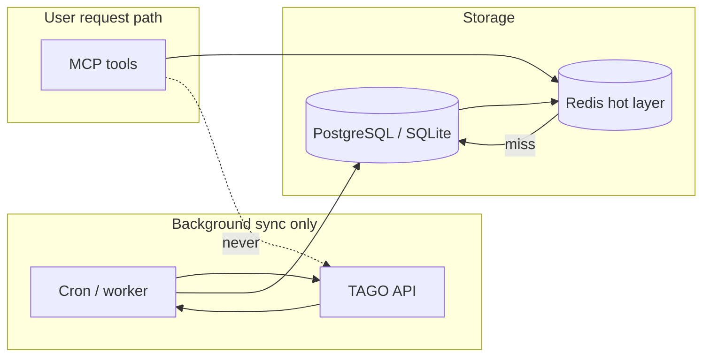

# Traffic Strategy (P0)

**Top priority:** run **keyless hosted MCP** for global users while staying under the TAGO **10,000 calls/day** ceiling (development key), then scale via operations + cache — not by asking foreigners to sign up at [data.go.kr](https://www.data.go.kr).

## Two meters (do not confuse)

| Meter | What counts | Limit | Who cares |
|-------|-------------|-------|-----------|
| **MCP tool calls** | Each `@tool` invocation | Free 500 / Plus 5,000 per user per day | Product, billing, Skill SOP |
| **TAGO upstream calls** | HTTP to TAGO train API | **10,000/day** (dev key) → higher after ops approval | Infra, cache design |

**Goal:** maximize MCP tool calls, **minimize** TAGO upstream calls.

```
Many MCP calls  ──►  read DB/Redis  ──►  TAGO only in background sync jobs
```

---

## Recommended: materialize timetables in DB + Redis

**Yes — this is feasible and preferred** over request-time TAGO + short TTL cache.

| Path | TAGO on user request | 10k/day feels like |
|------|----------------------|-------------------|
| Request-time API + Redis TTL | 0–1 per miss | Tight |
| **Sync → DB → Redis (read path)** | **0** | **Unlimited MCP reads** |

### Architecture



| Layer | Role |
|-------|------|
| **PostgreSQL** (or SQLite MVP) | Canonical store — `(dep, arr, date)` → train rows, `fetched_at`, `source=tago` |
| **Redis** | Hot read — same key as today, sub-ms; optional write-through from sync |
| **Sync worker** | Only component that calls TAGO — fixed schedule, fixed budget |

### Example schema

```sql
-- routes pre-defined or discovered on first sync
CREATE TABLE train_departures (
  dep_code    TEXT NOT NULL,
  arr_code    TEXT NOT NULL,
  travel_date TEXT NOT NULL,  -- YYYYMMDD
  dep_time    TEXT NOT NULL,  -- HH:MM
  arr_time    TEXT NOT NULL,
  train_type  TEXT NOT NULL,  -- KTX, SRT, ITX, ...
  train_no    TEXT,
  duration_min INT,
  fetched_at  TIMESTAMPTZ NOT NULL,
  PRIMARY KEY (dep_code, arr_code, travel_date, dep_time, train_type, train_no)
);
CREATE INDEX idx_route_date ON train_departures (dep_code, arr_code, travel_date);
```

`compare_ktx_srt` = `SELECT ... WHERE train_type IN ('KTX','SRT')` — **zero extra TAGO**.

### Sync budget (fits in 10k/day easily)

| Job | Frequency | TAGO calls / run | / day |
|-----|-----------|------------------|-------|
| Top **30 routes** × **today + tomorrow** | every **30 min** | 60 | **2,880** |
| Top 30 × **day+2 … day+7** | every **6 h** | 180 | **720** |
| Long-tail route (on-demand) | first user query | 1 | variable cap 500 |
| Station manifest | daily | 1 | 1 |
| **Total (steady)** | | | **~3,600** |

User MCP traffic: **unlimited** (reads DB/Redis only).

Long-tail: queue `sync_route(dep, arr, date)` — if not in DB and daily sync budget remains, fetch once and persist; else return `NO_TRAINS` + “sync scheduled”.

DB 동기화·호스팅: [compliance.md](../legal/compliance.md). 응답에 `fetched_at`·출처·면책 포함.

### Tradeoffs

| Pro | Con |
|-----|-----|
| TAGO decoupled from user spikes | Staleness up to sync interval (30 min OK for timetables) |
| Predictable cost | Must maintain sync worker + DB |
| `compare` / `plan_trip` free | Long-tail routes need on-demand sync or wider pre-sync list |
| Survives Redis flush | DB is source of truth |

**MVP:** SQLite + in-process sync (no Redis yet) → add Redis + Postgres when hosting multi-instance.

### Implementation order (revised P0)

1. `train_departures` table + `TimetableStore` read API  
2. `sync_worker` — top 30 routes, today+tomorrow every 30 min  
3. MCP tools read **only** `TimetableStore` (TagoGateway = sync-only)  
4. Redis in front of DB for hot routes  
5. On-demand sync for cache miss (capped)

Layers L2–L6 below remain useful as **fallback** until DB is warm, and for on-demand backfill.

---

## Product default: keyless hosted

| User | Experience |
|------|------------|
| **Traveler / ChatGPT / Cursor** | Connect hosted URL — **no API key**, no data.go.kr account |
| **Developer (optional)** | Self-host with own `DATA_GO_KR_SERVICE_KEY` (BYOK) |

Foreign users cannot reliably complete Korean portal signup → **hosted is not optional for GTM, it is the product.**

Server holds **one** TAGO service key. All users share the **10k/day** pool until production quota is raised.

---

## Naive vs optimized (1 user question)

Skill SOP triggers **6–7 MCP tool calls**. TAGO cost depends on implementation:

| Tool | TAGO calls (naive) | TAGO calls (optimized) |
|------|-------------------|------------------------|
| `get_today_kst` | 0 | 0 |
| `search_stations` ×2 | 0–2 | **0** (static `stations_i18n.json`) |
| `holiday_check` | 0* | 0* (*separate 공휴일 API, not TAGO train) |
| `search_trains` | 1 | 0–1 (cache hit = 0) |
| `compare_ktx_srt` | 2 | **0–1** (one fetch, split in memory) |
| `plan_trip` | +1 internal | **0** (reuse same request cache) |
| `get_booking_links` | 0 | 0 |

| Scenario | TAGO / question | Questions / day @ 10k TAGO |
|----------|-----------------|----------------------------|
| **Naive** | ~3 | ~3,300 |
| **Optimized** | **~1** | **~10,000** |
| **Optimized + 15m cache** (repeat routes) | ~0.2 effective | **~50,000+** equivalent |

---

## Layered defense (implementation order)

### L1 — Zero-TAGO tools (Week 1)

- `search_stations` → **only** `stations_i18n.json` + TAGO city list synced **daily** (1 TAGO job, not per user)
- `get_today_kst`, `get_booking_links` → no upstream
- `holiday_check` → 천문연 공휴일 API (separate quota)

### L2 — `TagoGateway` single entry (Week 1)

All train timetable reads go through one module:

```text
tools → TagoGateway.get_trains(dep, arr, date) → cache → HTTP
```

- `search_trains` and `compare_ktx_srt` **must not** call TAGO separately for the same `(dep, arr, date)`.
- `compare_ktx_srt` = one TAGO response, partition KTX vs SRT in Python.
- `plan_trip` = read from **request-scoped cache** only.

### L3 — TTL cache (Week 1–2)

| Cache key | TTL | Notes |
|-----------|-----|-------|
| `trains:{dep_code}:{arr_code}:{date}` | **15 min** default | Timetables rarely change minute-to-minute |
| `trains:...` (top-20 routes) | **30 min** | Seoul–Busan, Suseo–Busan, etc. |
| `stations:manifest` | **24 h** | Background refresh, not user-triggered |
| `holiday:{year}` | **7 d** | |

Hosted: **Redis** (shared across instances).  
Local dev: in-memory LRU.

### L4 — In-flight deduplication (Week 2)

Concurrent identical `(dep, arr, date)` → **one** TAGO request, others await (singleflight pattern).

### L5 — Stale-while-revalidate (Week 2–3)

When TAGO daily budget > 80%:

- Serve cache up to **60 min** stale with `disclaimer: "cached, may not reflect latest"`.
- Block only on cache miss + budget exhausted.

### L6 — Pre-warm (Week 3)

Cron at **04:00 KST** (before morning peak):

- Top **20 routes** × **today + tomorrow** = ≤40 TAGO calls/day fixed cost.
- Covers majority of tourist queries.

### L7 — Operational quota (Week 3–4, parallel)

1. Register **use case** on data.go.kr (hosted AI agent MCP, no booking).
2. Apply for **production / operations** key.
3. Request **traffic increase** (활용사례 등록 후 증설 신청).

Target: move from 10k → 100k+ TAGO/day before marketing push.

### L8 — MCP-side rate limit (protect TAGO pool)

Even with cache, cap **per-user** MCP calls (500 Free) so one bot cannot burn the shared TAGO budget.

---

## Budget dashboard (required metrics)

Log and alert on:

| Metric | Alert |
|--------|-------|
| `tago_calls_today` | > 8,000 (80%) |
| `tago_cache_hit_rate` | < 70% |
| `tago_calls_per_mcp_call` | > 0.5 rolling 1h |
| `mcp_calls_today` | growth only |

Expose internally: `GET /health` → `{ tago_remaining_estimate, cache_hit_rate }`.

---

## Capacity examples (optimized stack)

Assume **1 TAGO call per unique route/date** (15m cache), **6 MCP calls per user question**:

| Daily TAGO budget | Unique route/date fetches | MCP tool calls served (6×, 50% cache hit on repeats) |
|-------------------|---------------------------|--------------------------------------------------------|
| 10,000 | 10,000 | ~60,000–120,000 |
| 50,000 (ops) | 50,000 | ~300,000+ |

Pre-warm 40 + station sync 1 ≈ **41 TAGO/day** fixed overhead.

---

## What we will NOT do

- Ask end users for data.go.kr keys (except BYOK self-host docs)
- Call TAGO per `search_stations` query
- Run `compare_ktx_srt` as two uncached TAGO round-trips
- Scale by adding more dev keys (ToS / abuse risk)

---

## Checklist (P0 before public hosted launch)

- [ ] `train_departures` DB + `TimetableStore` read path
- [ ] `sync_worker` (TAGO → DB), top 30 routes / 30 min
- [ ] MCP tools — **no TAGO on request path**
- [ ] Redis hot layer on top of DB
- [ ] `search_stations` — static only at runtime
- [ ] `tago_calls_today` on **sync worker only** + 80% alert
- [ ] Hosted MCP — **no** client API key
- [ ] Production key + use case submitted

See [roadmap.md](../planning/roadmap.md) for phased delivery.
