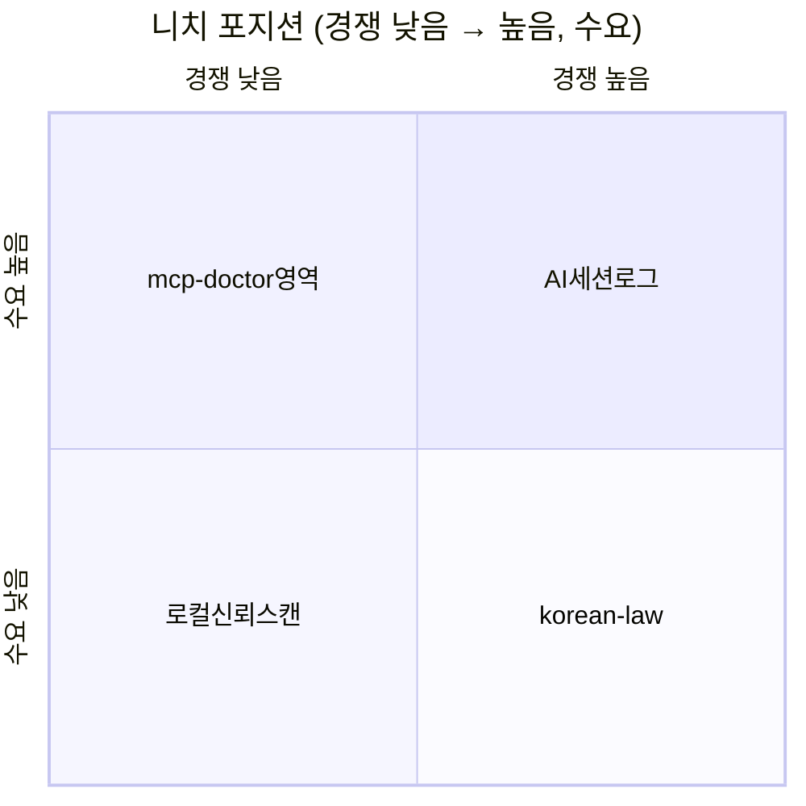

# MCP·AI 시장 조사 v8 — 단계별 (한 번에 하나)

**조사일:** 2026-06-30  
**제약:** 영업 없음 · 코드만 · 며칠 내 $1+ · 법률·DART·홈택스 제외  
**원칙:** v3~v7 결론은 **참고용**. **v8 5단계 확정:** `ktx-mcp` (TAGO, **한국+글로벌 다국어**, 저가·호출량) — [spec.md](./spec.md).

---

## v8 조사 파이프라인 (순서 고정)

| 단계 | 내용 | 상태 |
|------|------|------|
| **1** | **디스커버리 채널 인벤토리** — 어디를 볼지 목록화 | ✅ **완료** |
| **2** | **레이어 정의** — MCP / Skills / Apps / 플랫폼 게이트웨이 | ✅ **완료** |
| **3** | **축별 1개 키워드 배치 스캔** — L1~L4 Y/N | ✅ **완료** |
| 4 | 후보 매트릭스 + 수익 채널 매칭 | ✅ **완료** → [spec.md](./spec.md) §11 |
| 5 | 니치 1개 확정 + SPEC | ✅ **ktx-mcp** — 구현 레포: **`projectC`** (단일 Git) |

> v3~v7 상세는 아래 **레거시**로 유지. 새 결론은 **v8 단계 결과만** 반영.

---

## 0-H. 1단계 — 디스커버리 채널 인벤토리 (2026-06-30)

**목적:** 「Glama+Registry만 봤다」 ≠ 시장 전체. **먼저 조사 창구 목록**을 고정.

### A. MCP 서버 디렉터리·레지스트리

| # | 채널 | URL | 규모(공개 수치) | v3~v7 조사 |
|---|------|-----|----------------|------------|
| A1 | **공식 Registry** | https://registry.modelcontextprotocol.io | canonical | ✅ API 배치 |
| A2 | **Glama** | https://glama.ai/mcp/servers | ~29k | ✅ (타임아웃多) |
| A3 | **mcp.so** | https://mcp.so | ~19.7k+ | △ 일부 |
| A4 | **PulseMCP** | https://www.pulsemcp.com/servers | ~16k+ | ✅ |
| A5 | **Smithery** | https://smithery.ai/servers | ~7~10k+ | △ |
| A6 | **LobeHub MCP** | https://market.lobehub.com | 5.6万+ 언급 | ⬜ **1단계 신규** |
| A7 | MCP.directory | https://mcp.directory | 중간 | ⬜ |
| A8 | mcpservers.org | https://mcpservers.org | 중간 | △ |
| A9 | MCPize | https://mcpize.com | 마켓·호스팅 | △ |
| A10 | Cursor Directory | https://cursor.directory | IDE 특화 | ⬜ |
| A11 | Docker MCP Catalog | https://hub.docker.com/mcp/ | 공식 이미지 | ⬜ |
| A12 | freemcp.space | https://freemcp.space | 142 수동 검증 | ⬜ |
| A13 | Automation Switch | https://automationswitch.com/mcp | 링크 허브 | ⬜ |
| A14 | awesome-mcp-servers | GitHub punkpeye | 글로벌 | △ |
| A15 | awesome-mcp-korea | GitHub darjeeling | 한국 ~50+ | ✅ v7.1 |

**LobeHub 샘플 (1단계 교차):** `korea` 관련 플러그인 다수 — v7 미등재 (예: [korea-transit](https://lobehub.com/mcp/heisenbug0306-tech-korea-transit-mcp), [drfirst-korea-stock-mcp](https://market.lobehub.com/s/plugins/drfirst-korea-stock-mcp), [japan-transfer-mcp](https://market.lobehub.com/s/plugins/healthitjp-japan-transfer-mcp)).

**CLI (2단계~):** `npx -y @lobehub/market-cli mcp search --q "KEYWORD"`

### B. Agent Skills (MCP와 별도)

| # | 채널 | URL | 규모 | v3~v7 |
|---|------|-----|------|-------|
| B1 | LobeHub Skills | https://market.lobehub.com/s/skills | 10万+ | ⬜ |
| B2 | skills.sh | https://skills.sh | 60万 OSS 언급 | ⬜ |
| B3 | SkillsMP | — | 42万+ 언급 | ⬜ |
| B4 | Claude plugin marketplace | code.claude.com/docs/plugin-marketplaces | 스킬+MCP | ⬜ |
| B5 | ChatGPT Apps / Codex | developers.openai.com | 대기업 앱 | ⬜ |
| B6 | GitHub Skills (k-skill 등) | nomadamas/k-skill | KTX·KOBUS **스킬** | △ |

### C. 플랫폼 게이트웨이

| # | 채널 | URL | 역할 | v3~v7 |
|---|------|-----|------|-------|
| C1 | Composio Connect | https://connect.composio.dev/mcp | 1000+ SaaS | ⬜ |
| C2 | Pipeworx | https://pipeworx.io | read 데이터 776팩 | ⬜ |
| C3 | Pipedream / Zapier MCP | — | SaaS 자동화 | ⬜ |
| C4 | Apify MCP | https://apify.com/mcp/developers | PPE·스크래퍼 | △ |

### D. 수익 채널

MCPize · Apify PPE · Skills 마켓 · Gumroad/Polar · B2B 커스텀

### E. MCP 외 프로토콜

→ **0-I §F**로 이동 (2단계에서 정리)

### 1단계 결론

- 조사 창구 **30+**; v7은 **~10곳** 수준.  
- LobeHub·Skills·Composio·Pipeworx **본격 스캔 전**.  
- **다음:** ~~2단계~~ → **3단계** 축별 배치 스캔.

---

## 0-I. 2단계 — 4레이어 정의 (2026-06-30)

**목적:** 「MCP가 없다」와 「이미 있다」가 동시에 맞을 수 있음. **같은 니치가 레이어에 따라 다른 형태**로 존재하기 때문. 3단계 스캔 전에 **비교 단위**를 고정.

### 스택 한눈에

```
[사용자 / IDE / ChatGPT]
        │
   ┌────┴────┬──────────────┬─────────────────┐
   │  Apps   │   Skills     │  Platform GW    │  ← 배포·발견 채널이 다름
   │ (호스트 │  (SKILL.md   │  (Composio 등   │
   │  내장앱)│   절차 지식)  │   통합 MCP URL) │
   └────┬────┴──────┬───────┴────────┬────────┘
        │           │                │
        └───────────┴────────────────┘
                    │
              [ MCP 서버 ]  ← tools/resources/prompts (JSON-RPC, stdio/SSE/HTTP)
                    │
              [ 외부 API · DB · SaaS · 스크래퍼 ]
```

| 레이어 | 한 줄 정의 | 산출물 형태 | 1단계 채널 매핑 |
|--------|-----------|------------|----------------|
| **L1 MCP** | 에이전트가 **호출하는 도구·리소스**를 프로토콜로 노출 | `server.json`, Go/Python MCP 서버, Docker 이미지 | A1~A15 |
| **L2 Skills** | 에이전트가 **언제·어떻게** 일할지 가르치는 절차·SOP | `SKILL.md` 폴더 (+ 선택 스크립트) | B1~B6 |
| **L3 Apps** | **호스트 앱 스토어** 안의 대화형 미니앱 (UI iframe) | MCP 기반 + 호스트별 확장 (결제·디렉터리) | B4, B5 |
| **L4 Gateway** | **여러 통합을 한 MCP URL**로 묶는 중간층 | `gateway.*.io/mcp` 단일 엔드포인트 | C1~C4 |

**핵심:** L1만 보면 「공백」, L2·L4를 보면 「이미 있음」인 경우가 많음 (예: KTX — 전용 MCP는 드물지만 **k-skill**은 스킬로 존재).

---

### L1. MCP 서버

| 항목 | 내용 |
|------|------|
| **역할** | 연결층 — API·DB·파일·브라우저 등 **실행 가능한 capability** |
| **표준** | [Model Context Protocol](https://modelcontextprotocol.io) — tools / resources / prompts |
| **전송** | stdio (로컬), SSE/HTTP (원격), Docker Catalog 배포 |
| **발견** | Registry, Glama, Pulse, LobeHub **MCP 탭**, PyPI/npm `mcp` |
| **v7에서의 오류 패턴** | Registry `search=ktx` → 0건 **≠** 시장 공백 (GitHub·LobeHub·Skills에 분산) |
| **인디 $1+ 경로** | Gumroad/Polar 템플릿 · MCPize 호스팅 · Apify Actor+PPE · GitHub OSS → 유료 설정 가이드 |
| **경쟁 신호** | 동일 키워드 MCP **3곳 이상** + **공식 무료** (Notion/Todoist 등) → 신규 전체 구현 가치 ↓ |

**3단계 스캔 키:** Registry API · Glama/Pulse 검색 · LobeHub `market-cli mcp search` · GitHub `mcp KEYWORD` · PyPI

---

### L2. Agent Skills

| 항목 | 내용 |
|------|------|
| **역할** | 지시층 — **워크플로·도메인 관행·프롬프트 번들** (네트워크 호출은 선택) |
| **표준** | `SKILL.md` (YAML frontmatter: `name`, `description`) + 선택 스크립트·리소스 |
| **호스트** | Cursor (`.cursor/skills/`), Claude Code, Codex (`~/.codex/skills/`), Gemini CLI 등 **동일 폴더 구조** |
| **로딩** | description 메타만 상시; 본문은 **트리거 시** 컨텍스트 주입 (토큰 절약) |
| **MCP와 관계** | **상호 보완** — MCP=도구, Skill=절차. Skill만으로 `curl`/CLI 호출 가능 → **MCP 없이도 니치 충족** |
| **발견** | LobeHub Skills, skills.sh, SkillsMP, GitHub (`SKILL.md`, k-skill) |
| **인디 $1+ 경로** | 스킬 팩 번들(Gumroad) · 팀 SOP 스킬 · MCP보다 **납품 빠름** (코드 서버 불필요) |
| **경쟁 신호** | 동일 도메인 스킬이 skills.sh/LobeHub에 **이미 5+** → 차별은 **최신 API·한국어·엣지케이스**뿐 |

**3단계 스캔 키:** `skills.sh` / LobeHub Skills 검색 · GitHub `SKILL.md "KEYWORD"` · k-skill류 레포

**v7 교훈:** 「고속버스 MCP 없음」 ≠ 「고속버스 에이전트 지원 없음」 — **B6 k-skill**이 스킬 레이어에 존재.

---

### L3. ChatGPT·Claude Apps (호스트 내장 앱)

| 항목 | 내용 |
|------|------|
| **역할** | **배포·발견·UI** 레이어 — 대화 안 iframe, 스토어 디렉터리, 인앱 결제 |
| **OpenAI** | [Apps SDK](https://developers.openai.com/apps-sdk/) — **MCP 위에** UI·ChatGPT 확장 (`window.openai.*`) |
| **호환** | [MCP Apps UI 표준](https://developers.openai.com/apps-sdk/mcp-apps-in-chatgpt) — 이식성 ↑, ChatGPT 전용 기능은 선택 |
| **Claude** | Plugin marketplace — MCP 서버 + 스킬 패키지 혼합 |
| **Codex** | 승인된 ChatGPT 앱 → Codex 플러그인 전환 (2026 방향) |
| **MCP 디렉터리와 차이** | Glama 등록 ≠ ChatGPT 스토어 노출. **리뷰·브랜드·대기업** 비중 큼 |
| **인디 $1+ 경로** | 며칠 내 $1에는 **부적합** (리뷰·인프라·UI). 중장기 또는 B2B |
| **3단계 스캔 키** | ChatGPT Apps 디렉터리(공개 시) · Claude plugin 목록 · `developers.openai.com` 샘플 앱 |

**판정:** 니치 **수요 검증**용으로는 참고; **1차 수익 채널로는 우선순위 낮음** (제약: 영업 없음·며칠 내 $1).

---

### L4. 플랫폼 게이트웨이

| 항목 | 내용 |
|------|------|
| **역할** | N개 통합을 **1 MCP URL**로 — 인증·스키마·레이트리밋 통합 |
| **읽기형 (Pipeworx)** | SEC·FDA·FRED 등 **공공·기관 데이터** 1000+ 소스 → 에이전트 리서치 |
| **쓰기형 (Composio·Zapier·Pipedream)** | Slack·GitHub·Salesforce 등 **SaaS 액션** — 티켓·메시지·레코드 변경 |
| **스크래퍼형 (Apify)** | 웹 스크래핑 Actor → MCP로 노출, **PPE(종량)** 수익 모델 |
| **디렉터리와 혼동 주의** | Smithery/Glama = **목록**; Pipeworx/Composio = **실행 게이트웨이** |
| **니치와의 관계** | 한국 TAGO·KOBUS 등 **단일 API**는 게이트웨이에 **아직 없을 수 있음** → L1 독립 MCP 여지 |
| **인디 $1+ 경로** | 게이트웨이 자체 구축 X. **Apify Actor** 또는 **L1 얇은 MCP**가 현실적 |
| **3단계 스캔 키** | Composio toolkit 검색 · Pipeworx pack 목록 · Apify Store `KEYWORD` |

**스택 관행 (Pipeworx 문서):** 읽기=Pipeworx류 + 쓰기=Composio류 **병행** — 우리 조사는 **니치 1개**이므로 L4 전체 커버 여부만 체크.

---

### F. 인접 프로토콜 (MCP 외 — 혼동 방지)

| 프로토콜 | 역할 | 니치 조사 시 |
|----------|------|-------------|
| **MCP Apps UI** | MCP tool + **iframe UI** 표준 | L3와 겹침; ChatGPT·다호스트 이식 |
| **A2A** (Agent2Agent) | **에이전트 간** 메시징·위임 | 단일 도메인 MCP 니치와 직접 경쟁 적음 |
| **ACP** (Agent Communication Protocol) | 에이전트 상호운용 (BeeAI 등) | 초기; 디렉터리 스캔 제외 가능 |
| **AGENTS.md** | **레포 단위** 코딩 에이전트 README | Skills와 유사하나 프로젝트 로컬; 마켓 니치 ↓ |

→ **3~5단계 기본 스코프: L1~L4.** 위는 「MCP만 만들면 된다」 오판 방지용.

---

### G. 레이어 간 경쟁 매트릭스 (스캔 시 질문)

니치 키워드 `X`에 대해 **각 셀을 Y/N**으로만 채움 (3단계 템플릿).

| 질문 | L1 MCP | L2 Skill | L3 App | L4 GW |
|------|--------|----------|--------|-------|
| 공식·무료 호스트 통합 있음? | | | | |
| 서드파티 OSS 2건+? | | | | |
| 유료 전용 ($9+/mo) 있음? | | | | |
| **우리가 48h 내 낼 수 있는 형태** | 서버 | 스킬 | 앱 | 커넥터 |

**포화 판정 (4단계로 넘기기 전 휴리스틱):**

- L1 **Y** + 공식 무료 **Y** → L1 신규 **보류** (버그픽·얇은 래퍼만 검토)
- L1 **N** + L2 **Y** → **스킬 개선版** 또는 **L1 얇은 MCP** 중 선택
- L4 **Y** (Pipeworx/Composio에 이미 pack) → L1 **가치 ↓↓**
- L3만 **Y** → 대기업·브랜드 영역; 인디 1차 제외

---

### H. 수익 채널 × 레이어 (1단계 D 보강)

| 수익 채널 | 주 레이어 | 며칠 $1+ 적합도 |
|-----------|----------|----------------|
| Gumroad / Polar 디지털 | L1 템플릿, L2 스킬 팩 | **高** |
| Apify PPE | L1 (Actor) | **中** (스토어 트래픽 의존) |
| MCPize 호스팅 | L1 | **中** |
| Registry·Glama 무료 등록 | L1 | 수익 직접 X (유입용) |
| ChatGPT Apps 스토어 | L3 | **低** (리뷰·UI) |
| Composio/Pipeworx 파트너 | L4 | **低** (B2B) |
| B2B 커스텀 MCP | L1 | **中** (영업 제약으로 제외) |

---

### 2단계 결론

1. v7 「Registry 0 = 공백」은 **L1 편향**; **L2·L4 미스캔**이 구멍이었음.  
2. **Skills**는 MCP와 경쟁이 아니라 **대체·보완** — 같은 니치를 먼저 먹을 수 있음.  
3. **Apps·Enterprise GW**는 시장 크지만 **제약(며칠·$1·영업 없음)**과 맞지 않음 → 3단계는 **L1+L2 중심**, L4는 **pack 존재 여부만**.  
4. ~~**다음 (3단계):**~~ → **3단계 완료** (§0-J).

---

## 0-J. 3단계 — 12분류 × 1키워드 배치 스캔 (2026-06-30)

**방법:** v7.1 **12분류**마다 대표 키워드 1개 · **L1~L4 Y/N** (§0-I 매트릭스)  
**소스:** Registry API · GitHub `mcp KEYWORD` · PulseMCP·skills.sh·LobeHub 샘플(1단계) · Composio/Pipeworx/Apify 웹 · v7.1 교차  
**한계:** LobeHub `market-cli`는 **`lhm register` 또는 `MARKET_CLIENT_ID`/`SECRET` 필요** — 미인증 시 검색 0건·exit 1. 3단계는 **웹 URL·1단계 샘플·GitHub**로 L1 보강.

### 스캔 키워드

| # | 분류 | 3단계 키워드 | Registry | GitHub `mcp …` |
|---|------|-------------|----------|----------------|
| 1 | 법률·정부 | `korean-law` | 0 | 42+ |
| 2 | 커머스 | `coupang` | 0 | 6 |
| 3 | 금융·세무 | `krx` | 1 | 15+ |
| 4 | 부동산 | `jeonse` | 0 | 0※ |
| 5 | 지도·주소 | `kakao-map` | 0 | 7+ |
| 6 | 검색·트렌드 | `naver-search` | 0 | 17+ |
| 7 | 관광·여행 | `korea-tourism` | 0 | 7+ |
| 8 | 공공데이터 | `data-go-kr` | 0 | 14+ |
| 9 | 날씨 | `kma-weather` | 0 | 1+ (v7: 6+ MCP) |
| 10 | 교통·시내 | `ktx` | 0 | 4 |
| 11 | 한국어 NLP | `hwp` | 1 | 15+ |
| 12 | 협업 | `dooray` | 0 | 18+ |

※ `jeonse` 단독 0건이나 `real-estate korea mcp` → **8건** (real-estate-mcp 등). **키워드에 따라 공백/포화가 갈림.**

### 레이어 매트릭스 (Y/N)

| # | 분류 | L1 MCP | L2 Skill | L3 App | L4 GW | 포화 | 48h 산출물 |
|---|------|--------|----------|--------|-------|------|-----------|
| 1 | 법률·정부 | **Y** | N | N | N | **포화** | — (제외) |
| 2 | 커머스 | △ | N | **Y**† | N | **포화** | — |
| 3 | 금융·세무 | **Y** | N | N | △ | **포화** | — |
| 4 | 부동산 | **Y**‡ | N | N | N | **포화** | — |
| 5 | 지도·주소 | **Y** | N | △ | N | **포화** | — |
| 6 | 검색·트렌드 | **Y** | N | N | **Y**§ | **포화** | — |
| 7 | 관광·여행 | **Y** | N | N | N | **포화** | — |
| 8 | 공공데이터 | **Y** | N | N | N | **포화** | — |
| 9 | 날씨 | **Y** | N | N | N | **포화** | — |
| 10 | 교통·시내 | △ | **Y** | N | △ | **시내 포화·KTX 얇음** | MCP·스킬 둘 다 경쟁 |
| 11 | 한국어 NLP | **Y** | **Y** | N | N | **중간~포화** | 스킬 개선版만 |
| 12 | 협업 | **Y** | N | N | N | **B2B 니치** | Dooray 전용·좁음 |

**각주**

- † **L3:** [요기요 ChatGPT 공식 앱](https://techblog.yogiyo.co.kr/) (MCP+위젯). `coupang` OSS MCP는 약함 → **배달은 L3 대기업 점유**.
- ‡ L1: `jeonse` 검색 0 → `real-estate-mcp`, `mcp-kr-realestate` 등 **별도 키워드에 존재**.
- § **L4:** [Composio SerpAPI](https://composio.dev/toolkits/serpapi) 툴킷 내 **Naver Search** (한국 검색 간접 커버).
- **L1 법률:** Pulse [dikehomme-korean-law](https://www.pulsemcp.com/servers/dikehomme-korean-law), [Ansvar 공식](https://www.pulsemcp.com/servers/ansvar-south-korean-law) 등 **다수**.
- **L1 금융:** [koreanpulse](https://koreanpulse.dev/) **$29+/mo** + LobeHub 주식 MCP 다수 + pykrx/oss.
- **L1 교통:** [korea-transit-mcp](https://github.com/heisenbug0306-tech/korea-transit-mcp) = **시내**; KTX 전용 TAGO 시각표 MCP는 **얇음**. GitHub `Kaelio/ktx` 등 소수.
- **L2 교통:** [ktx-booking](https://skills.sh/nomadamas/k-skill/ktx-booking), express-bus 스킬 (k-skill) — **MCP 없어도 스킬로 충족**.
- **L4 교통:** [Apify 서울 광역철 스크래퍼](https://apify.com/jungle_synthesizer/south-korea-rail-transit-scraper) — **KTX/SRT v1 명시적 미지원**.
- **L2·L1 NLP:** [kordoc 스킬](https://skills.sh/aradotso/trending-skills/kordoc-korean-document-parser) + treesoop/kordoc MCP류.

### Registry vs 실제 (3단계 핵심 수치)

| 지표 | 값 |
|------|-----|
| 12키워드 중 Registry **0건** | **10/12** (83%) |
| GitHub `mcp KEYWORD` **2건+** (동일 키워드) | **9/12** |
| L2 Skill **Y** | **2/12** (ktx, hwp) |
| L3 App **Y** (한국) | **1/12** (요기요·배달 축) |
| L4 GW **한국 전용 pack** | **0/12** (Pipeworx 한국 없음; Composio는 Naver 등 간접) |

→ **v7 「Registry 0 = 공백」 오판이 3단계에서 재현됨.** 스캔은 **Registry + GitHub + Pulse + Skills** 최소 세트 필요.

### 분류별 한 줄

| 분류 | 3단계 판정 |
|------|-----------|
| 법률·정부 | L1 다수 · 제약상 **제외** |
| 커머스 | L3 요기요 공식 · OSS coupang MCP **비경쟁** |
| 금융 | L1+유료 koreanpulse · **신규 전체 구현 비추** |
| 부동산 | L1 있음(jeonse 키워드만 0) · **포화** |
| 지도·검색 | L1+Naver Pulse 다수 · L4 Composio 간접 · **포화** |
| 관광·공공·날씨 | L1 GitHub/Pulse **포화** |
| **교통** | 시내 L1 **포화** · KTX L1 **△** · **L2 이미 존재** → 「MCP만」 공백 ≠ 「에이전트 지원」 공백 |
| NLP | L1+L2 **둘 다** · 개선版만 여지 |
| 협업 | L1 OSS 18+ · **B2B·Dooray 키** 필요 |

### 3단계 결론 (니치 미확정)

1. **12분류 중 10분류는 4레이어 합쳐 포화** — v7.1과 일치, **L2·L3·L4 추가로 더 확실**.  
2. **교통(KTX 키워드):** L1 TAGO 조회 MCP는 여전히 **얇을 수 있음**; 그러나 **L2 k-skill이 예약·조회 커버** → 「처음부터 MCP」 우선순위 **하락**.  
3. **48h·$1·영업 없음**에 맞는 잔여 형태: **(a)** 기존 OSS **버그 1개 PR/포크**, **(b)** **스킬 개선版**(ktx/hwp/kobus), **(c)** **Apify Actor** 얇은 래퍼 — **4단계에서 수익 채널과 매칭**.  
4. **다음:** 4단계 — 위 △·개선版 후보만 추려 **수익 채널 × 난이도** 표.

---

## 0. 조사 라운드 요약 (레거시 v3~v7)

| 라운드 | 범위 | 플랫폼 | 결론 |
|--------|------|--------|------|
| **1~4차 (v3~v6)** | 전역 200+ 키워드 | 다중 | Go mod / server.json / 광역 스캔 |
| **5차 (v7)** | **한국 생활·교통만** 80+ 키워드 | Registry + 6사이트 | **서울 지하철·data.go.kr·지도는 포화**; **KTX/SRT MCP 공백** |

**v7 메모 (확정 아님):** C축 후보 `ktx-mcp`·`kobus`·`unipass` 등 → **v8 5단계까지 보류**

> ⚠️ **v7 한계 (사용자 지적 반영):** 「한국 생활·교통」이라 해도 **한국 관련 전부를 조사한 것이 아님**. 1차는 교통·공공데이터·일부 금융 키워드(~90) 위주. **v7.1**에서 [awesome-mcp-korea](https://github.com/darjeeling/awesome-mcp-korea) + Registry **120키워드** + GitHub 교차로 범위 확대.

| 라운드 | 범위 | 플랫폼 | 결론 |
|--------|------|--------|------|
| **6차 (v7.1)** | **한국 전 카테고리** 12분류 + Registry 120term | awesome-mcp-korea, GitHub, npm/PyPI | **법률·지도·부동산·주식·날씨·관광·검색은 포화**; **고속철·고속버스 MCP·통관**만 상대 공백 |

---

## 0-C. 멀티 플랫폼 교차 조사 (v5)

Glama만 보면 공백처럼 보이던 니치가, 다른 디렉터리에서는 **이미 구현·등록**된 경우가 많음.

### 조사한 플랫폼 (10+)

| 플랫폼 | URL | 역할 | v5에서 확인한 것 |
|--------|-----|------|------------------|
| **Glama** | glama.ai/mcp/servers | 대형 디렉터리 (~50k) | 1·2차 베이스; fetch 타임아웃多 |
| **PulseMCP** | pulsemcp.com/servers | 미러 + server.json | go-dev-tools, MCPDoctor, mcp-lint, SolvoHQ migration |
| **공식 Registry** | registry.modelcontextprotocol.io | **정본** API `v0.1/servers?search=` | 4DA, dep-diff, migrationpilot, Sonatype dep-mgmt |
| **mcp.so** | chat.mcp.so | 커뮤니티 디렉터리 | package-registry (Artmann), knip, npm-helper |
| **Smithery** | smithery.ai/servers | 호스팅·마켓 | package-version-check, GitLab Go MCP |
| **MCPize** | mcpize.com | 호스팅·수익화 (~1k 서버) | Go 배포 가능; 디렉터리·게이트웨이 |
| **Cursor Directory** | cursor.directory/plugins | Cursor 플러그인 | gopls-mcp, Go Documentation |
| **LobeHub** | market.lobehub.com | MCP 플러그인 마켓 | rethunk-mcp-golang 등 |
| **Docker Catalog** | hub.docker.com/mcp | 컨테이너 MCP | Go 이미지 다수 (k8s, keeper 등) |
| **OpenTools** | opentools.ai/mcp | 디렉터리 | 서비스별 랭킹 |
| **GitHub** | 직접 | 소스·server.json | mcpcheck, MCP-Doctor, 4DA, mcp-gopls |

### 니치별 교차 매트릭스 (핵심 경쟁자)

#### A. Go 모듈 / 의존성 업그레이드

| 서버 | 플랫폼 | Go 특화 | diff/순서 | 비고 |
|------|--------|---------|-----------|------|
| [4DA mcp-server](https://github.com/4DA-Systems/4DA/tree/main/mcp-4da-server) | GitHub + **공식 Registry** `io.github.runyourempire/4da-mcp-server` | △ (`go.mod` 읽음) | `upgrade_planner` | npm/crates/pypi **통합**; npx |
| [dep-diff-mcp](https://glama.ai/mcp/servers/DigiCatalyst-Systems/dep-diff-mcp) | Glama + Registry | ✗ | lockfile diff | **npm/PyPI만** |
| [go-dev-mcp](https://github.com/MrFixit96/go-dev-mcp) | PulseMCP go-dev-tools | ○ | `go mod` 서브커맨드 | 빌드·테스트·mod 관리; **업그레이드 플랜 아님** |
| [mcp-gopls](https://github.com/hloiseau/mcp-gopls) | GitHub | ○ | `module_graph`, govulncheck | tidy/vulncheck; **ref 간 diff 없음** |
| [gopls mcp](https://go.dev/gopls/features/mcp) | 공식 Go | ○ | `go_vulncheck` | 언어서버 래퍼 |
| [mcp-package-version](https://github.com/sammcj/mcp-package-version) | GitHub | △ | 최신 버전 조회 | Go **바이너리**; diff 없음 |
| [package-version-check](https://github.com/MShekow/package-version-check-mcp) | Smithery + Registry | △ | 멀티 생태계 | Go 모듈 **버전만** |
| [dependency-migration-mcp](https://github.com/SolvoHQ/dependency-migration-mcp) | PulseMCP + Registry | △ | breaking·codemod 브리프 | 0★, 2026-05 |
| [pkg-go-dev](https://registry.modelcontextprotocol.io) | Registry `pipeworx-io/pkg-go-dev` | △ | proxy.golang.org 래퍼 | 검색·메타 |

**v5 판정:** Glama 단독 “공백” **과장**. 여전히 **`go.sum` git ref diff + workspace 업그레이드 순서 + 오프라인 Go exe** 조합은 **미충족** → 좁은 틈새 유지.

#### B. MCP 설정 / Registry 린트

| 도구 | 플랫폼 | 대상 | 비고 |
|------|--------|------|------|
| [mcpcheck](https://github.com/MukundaKatta/mcpcheck) | GitHub | `mcp.json`, Cursor, Claude | SARIF·CI·규칙 다수 — **강력** |
| [MCP-Doctor](https://github.com/stephenywilson/MCP-Doctor/) | GitHub | `.cursor/mcp.json`, Windows PATH | 20+ 실패 패턴; **#2와 거의 동일 영역** |
| [mcpdoctor](https://github.com/gilangjavier/mcpdoctor) | PulseMCP + npx | `mcpServers` lint/normalize | 2026-03, 0★ |
| [mcp-config-lint](https://github.com/basilalshukaili/mcp-config-lint) | GitHub | 보안·구조 | CI 액션 |
| [mcp-lint](https://www.pulsemcp.com/servers/robert19001-cmyk-lint) | PulseMCP + Registry | **tool 스키마** | 클라이언트 config 아님 |
| Glama `server.json` 전용 | Glama | publisher manifest | **전용 린터 거의 없음** |

**v5 판정:** **`mcp.json` / Cursor config 린트 → 포화 (하지 말 것)**.  
**`server.json` (MCP Registry publisher manifest) 정적 린트** → 여전히 약한 경쟁.

#### C. DB migration 린트 (2차 #6 보완)

| 서버 | 플랫폼 | 비고 |
|------|--------|------|
| [migrationpilot](https://registry.modelcontextprotocol.io) `io.github.mickelsamuel/migrationpilot` | **공식 Registry** | PostgreSQL 83 rules, lock 분석 |
| mcp-atlas migrate-lint | Glama | Atlas 전용 |
| mcp-migration-advisor | Java suite npx | Flyway/Liquibase |

**v5 판정:** Flyway/Liquibase **범용 오프라인**은 여전히 약하지만, Postgres는 migrationpilot이 강함 → **우선순위 하향**.

### Glama-only 조사의 함정 (교훈)

| v3~v4 가정 | 멀티 플랫폼 실제 |
|------------|------------------|
| “Go 업그레이드 MCP 없음” | 4DA `upgrade_planner`, mcp-gopls, go-dev-mcp, sammcj |
| “mcp.json 린터 공백” | mcpcheck, MCP-Doctor, mcpdoctor **이미 성숙** |
| “dep-diff만 벤치” | SolvoHQ migration, Sonatype official, dependency-freshness |

**등록 전략:** Glama만이 아니라 **공식 Registry server.json** + PulseMCP + MCPize + mcp.so **동시 등록**이 유입에 유리 ([MCPize](https://mcpize.com/) 1k+ 마켓, Registry API 검색).

---

## 0-D. 4차 광역 스캔 (v6) — ~200 키워드 × 공식 Registry API

방법: `GET registry.modelcontextprotocol.io/v0.1/servers?search={term}&version=latest` 배치 실행 후, **0건·저건** 키워드는 PulseMCP / mcp.so / Smithery / Glama로 교차 확인.

### 테마별 요약 (포화 vs 공백)

| 테마 | Registry 검색 | 다른 플랫폼 실제 | v6 판정 |
|------|---------------|------------------|---------|
| **생활** recipe·meal·grocery·habit·pomodoro | 1~2건 (CSOAI 류) | PulseMCP MealMastery·Spoonacular·Paprika; Glama Habitica·TickTick·Shiori | **포화** |
| **금융** invoice·payroll·bookkeeping·stripe | bookkeeping **0건** | Smithery Frihet(31 tools)·Moneybird·Zoho Books | **포화** (Smithery) |
| **여행** flight·hotel·airbnb·itinerary | airbnb·itinerary **0건** | hotel 2건(SerpAPI 등) | **중간** |
| **메이커** 3d-print·cnc·laser·slicer | **전부 0건** | mcp.so [3D Printer MCP](https://chat.mcp.so/ja/server/DMontgomery40_mcp-3D-printer-server/MCP-Mirror); openscad **4+** GitHub | **포화** (Registry 미등록) |
| **학습** flashcard·leetcode·anki | flashcard 2·leetcode 2 | mcpservers.org·GitHub anki-mcp **5+** | **포화** |
| **취미** ham-radio·sdr·midi·shazam | **0건** | wsjt-mcp 1건; 음악 API 래퍼 다수 | **희소·수요 좁음** |
| **부동산** zillow·mls | mls **0**, zillow 1 | — | **중간** |
| **DevSec** renovate·semgrep·trivy·gitleaks | **전부 0건** | GitHub [renovate-mcp](https://github.com/tibuntu/renovate-mcp); **GitHub 공식 dependabot toolset**; dep-diff | **공식·GitHub가 점유** |
| **Git 훅** pre-commit·husky·lefthook | **전부 0건** | MegaLinter MCP 등 간접 | **직접 MCP 거의 없음·수요 낮음** |
| **Feature flag** launchdarkly·unleash | **0건** | Bucket MCP (mcp.so) | **중간** |
| **ML/RAG** ollama·embeddings·llamaindex | ollama 다수·llamaindex **0** | Glama/Pulse 포화 | **포화** |
| **브라우저** playwright·puppeteer·browser-use | 다수 | computer-use 공식화 중 | **포화** |
| **디자인** figma·sketch·canva | figma 다수 | — | **포화** |
| **CRM** hubspot·salesforce·zendesk | 각 1~3+ | CData·공식 래퍼 | **포화** |
| **한국 법·세무** dart·nts·hometax | hometax·unipass **0** | Glama taxlaw-nts·korean-law·LexGuard·koreanpulse | **법률 포화** / **실무 API Registry 공백** |
| **한국 생활 API** korail·seoul-metro·kakao-map·data-go-kr | **전부 0건** | Glama seoul tourism 2건·공공데이터 score 3 | **Registry 공백·품질 낮음** → #4 대안 |
| **문서** docx·pptx·pandoc·typst | pptx·pandoc **0** | PDF MCP 포화 | **부분 포화** |
| **정책/IAM** opa·openfga·cerbos | **0건** | — | **희소** |
| **모바일** appium·detox·maestro | detox·maestro **0** | — | **중간** |

### Registry 0건이어도 “공백”이 **아닌** 대표 (교훈)

| 키워드 (Registry 0) | 실제 존재처 |
|---------------------|-------------|
| 3d-print / cnc / laser | mcp.so 3D Printer MCP, OctoPrint/Klipper |
| bookkeeping | Smithery Frihet |
| renovate | GitHub [tibuntu/renovate-mcp](https://github.com/tibuntu/renovate-mcp) |
| semgrep / dependabot | GitHub MCP Server **dependabot toolset** (공식) |
| habit / pomodoro | Glama Shiori, Habitica, TickTick |
| anki | GitHub 5+, mcpservers.org |
| openscad | 4+ 독립 서버 (Glama/Pulse) |

### v6에서도 **상대적 공백**으로 남는 것

| 순위 | 니치 | 근거 |
|------|------|------|
| 1 | **Go `go.sum` git ref diff 플래너** | dep-diff [로드맵에 go.mod만 언급·미구현](https://dev.to/kaustubhdgr8/i-read-600-github-release-notes-so-you-dont-have-to-introducing-dep-diff-mcp-2o1j); 4DA는 통합·npx |
| 2 | **`server.json` Registry 린트** | mcpcheck=MCP **클라이언트**; 퍼블리셔 manifest 전용 거의 없음 |
| 3 | **한국 교통·통관 실무** (korail·지하철·unipass) | Registry **0**; 법률 MCP와 달리 **생활·물류** — 단 API 키·약관 부담 |
| — | Renovate 설정 MCP | renovate-mcp 존재(9★) → **비추천** |
| — | 메이커·레시피·습관·Anki | 멀티플랫폼 **포화** |

### v6 스코어 변동

Top 7 **순위 변경 없음**. #4 한국 공공데이터 → **「한국 생활·교통 API 초소형」** 으로 포지션 명확화 (법률·세무와 분리).

---

## 0-E. 5차 한국(C) 심층 — Registry 80키워드 + 6플랫폼

### 방법
- Registry API: `korail`, `ktx`, `srt`, `subway`, `kakao`, `data-go-kr`, `unipass`, `hometax` 등 **80+ term**
- 교차: PulseMCP, Glama, mcp.so, Smithery, PyPI, GitHub, [PlayMCP(카카오)](https://playmcp.kakao.com)

### 한국 카테고리별 판정

| 영역 | Registry | 다른 플랫폼 실제 | v7 판정 |
|------|----------|------------------|---------|
| **서울 지하철·버스 실시간** | subway 0, bus 5 | [korea-transit-mcp](https://github.com/heisenbug0306-tech/korea-transit-mcp) 호스팅·PlayMCP; [korea-transit-mcp-server](https://pypi.org/project/korea-transit-mcp-server/) PyPI; [Seoul TAGO Subway](https://www.pulsemcp.com/servers/slicequeue-seoul-tago-subway) | **포화 — 하지 말 것** |
| **길찾기·지도** | kakao/naver 0 | Glama TMAP·네이버길찾기·카카오; Smithery **kakao/maps** 공식 | **포화** |
| **data.go.kr 범용** | data-go-kr 0 | [fieldcure-mcp-publicdata](https://github.com/fieldcure/fieldcure-mcp-publicdata) 8만 API; [opendata-mcp](https://github.com/aeriis-kr/opendata-mcp); norounder PyPI 모듈들 | **포화** |
| **날씨·미세먼지·환율** | pm25 0, krw 0 | [SongT-50 korean-public-data-mcp](https://glama.ai/mcp/connectors/io.github.SongT-50/korean-public-data-mcp); [lazymac-k-mcp](https://github.com/lazymac2x/lazymac-k-mcp); [govdata-korea](https://api.lazy-mac.com/govdata-korea) 호스팅 | **포화** |
| **사업자번호·공휴일** | business-reg 0 | [nts-bizinfo-mcp](https://github.com/yakuda81-cpu/nts-bizinfo-mcp); lazymac `k_business_validator` | **포화** |
| **관광·서울 시설** | tourism 2 | [Seoul Essentials](https://www.pulsemcp.com/servers/do-droid-seoul-essentials) 무료 HTTP; [seoul-tourism](https://glama.ai/mcp/connectors/io.github.namuaix/seoul-tourism) | **포화** |
| **공항** | — | [Korean Airport Departure Readiness](https://www.pulsemcp.com/servers/gh-jinhyuk9714-airport-ready) (3/24) | **니치 있음** (협소) |
| **주식·DART** | dart 5, kospi 0 | [koreanpulse](https://koreanpulse.dev/) **유료 $29/mo**; jjlabsio korea-stock-mcp | **포화·유료 경쟁** |
| **법률·세무** | law 0, hometax 0 | taxlaw-nts, LexGuard, korean-law 1730+ | **포화 — 제외** |
| **KTX·SRT·코레일** | korail·ktx·srt **전부 0** | MCP **없음**. Python만: [SRT](https://github.com/ryanking13/SRT), [korail2](https://github.com/carpedm20/korail2), [koreantrain](https://github.com/djohnkang/koreantrain) | **공백 ← C 확정** |
| **통관 unipass** | unipass **0** | Glama 관세 **법령해석**만 (korean-law-alio); 실무 통관 MCP 없음 | **약한 공백 (2순위)** |

### Registry 0이어도 포기한 이유 (C 관점)

서울 교통·공공데이터·지도는 Registry에 없어도 **PyPI/GitHub/호스팅**에 이미 풀제품 존재 → “Registry 공백”이 **시장 공백이 아님**.

### v7 C축 Top 3 (한국만)

| 순위 | 제품 (가칭) | 포지션 | 경쟁 | 수익 |
|------|-------------|--------|------|------|
| **C1** | **`ktx-mcp`** | KTX·SRT·ITX **시각표·역 검색·잔여석 조회**(읽기 전용) | **MCP 없음** | 무료 stdio + MCPize Pro(알림·일정) |
| **C2** | **`unipass-mcp`** | 수입통관 상태·HS 코드 힌트 (초소형) | Registry 0 | B2B 틈새, 키 어려움 |
| **C3** | **`kr-trip-bundle`** | KTX + 공휴일 + 공항대기 **에이전트 번들** | 각각 개별 MCP 존재 | “묶음” 차별만 — **C1에 흡수 권장** |

### C1 상세 — `ktx-mcp` (권장)

**하지 않는 것:** 좌석 **예약·결제** (korail2/SRT 스크래핑·계정·ToS 리스크)

**v0.1 Tools (4~5개)**
| Tool | 설명 |
|------|------|
| `search_stations` | 역명 → 코드 (수서·서울·부산 등) |
| `search_trains` | 출발·도착·날짜·시간대 → KTX/SRT/ITX 목록 |
| `train_detail` | 열차 1건 상세 (소요·요금 구간·특실 여부) |
| `compare_ktx_srt` | 동일 구간 KTX vs SRT 나란히 |
| `holiday_check` | 출발일 공휴일 여부 (천문연 공공 API, nts-bizinfo와 **중복 최소화**) |

**데이터 소스 (후보)**
- 공공 API·TAGO 열차 시간표 (활용신청 필요)
- 또는 **읽기 전용** 공개 시간표 + 명시적 “예약 링크만 제공”

**차별 (개선版)**
- [korea-transit-mcp](https://koreatransitmcp.vercel.app/mcp) = **서울 시내** 버스·지하철  
- [slicequeue TAGO](https://www.pulsemcp.com/servers/slicequeue-seoul-tago-subway) = **서울 지하철** 시간표  
- **ktx-mcp** = **수도권↔지방 고속철** (KTX/SRT) — **겹치지 않음**

**등록:** 공식 Registry `io.github.{you}/ktx-mcp` → PulseMCP → MCPize → Glama

---

## 0-F. 6차 한국 전역 스캔 (v7.1) — 「다 찾은 게 아니다」 정정

### v7에서 **빠졌던** 것 (1차 조사 편향)

| 편향 | 실제로 있었던 서버 (v7 미기재) |
|------|-------------------------------|
| 「버스 = 포화」만 봄 | [korbus-mcp](https://www.npmjs.com/package/korbus-mcp) — 서울·경기 **실시간 버스** + 알림 (PyPI/npm) |
| 주차 미조사 | [parking-mcp2](https://github.com/acorn025/parking-mcp2) — 전국 주차 + 서울 실시간 |
| 부동산·전세 미조사 | [korea-finance-mcp](https://github.com/emceeKim/korea-finance-mcp) (전세가율·RTMS), [real-estate-mcp](https://github.com/tae0y/real-estate-mcp), [mcp-kr-realestate](https://github.com/ChangooLee/mcp-kr-realestate) |
| 비자·여행 미조사 | [Triplus](https://github.com/gaon12/Triplus) — 입국비자·대사관·공항·환율·휴일 |
| 네이버·로컬 미조사 | [kimcp](https://github.com/zeikar/kimcp), [korean-data-mcp](https://github.com/leadbrain/korean-data-mcp) (당근·번개·무신사·멜론) |
| 결제·PG | [bootpay-mcp](https://github.com/bootpay/bootpay-mcp) — 토스·카카오페이 등 54 tools |
| 큐레이션 목록 미활용 | [awesome-mcp-korea](https://github.com/darjeeling/awesome-mcp-korea) — **12카테고리 50+ 서버** |

### 조사 방법 (v7.1)

1. **Registry API** — 120 term 배치 (`scripts/kr-registry-scan.ps1`)  
2. **[awesome-mcp-korea](https://raw.githubusercontent.com/darjeeling/awesome-mcp-korea/main/README.md)** 전 카테고리 인덱싱  
3. GitHub·npm·PyPI·PulseMCP 교차 (korbus, parking, Triplus, finance 등)

### 한국 12분류 × MCP 존재 여부 (v7.1)

| 분류 | 대표 MCP | v7.1 판정 |
|------|----------|-----------|
| **법률·정부** | korean-law-mcp, LexLink, assembly-api, korean-law-alio | **포화** (제외) |
| **커머스** | daiso-mcp, kr-pc-deals-mcp, korean-data-mcp(중고) | **포화** |
| **금융·세무** | korea-finance-mcp, pykrx, KIS, koreanpulse, bootpay-mcp | **포화** |
| **부동산** | real-estate-mcp, mcp-kr-realestate, korea-finance `get_jeonse_ratio` | **포화** |
| **지도·주소** | kimcp, navermap×3, kakao×4, Smithery kakao/maps | **포화** |
| **검색·트렌드** | naver-search-mcp, py-mcp-naver-search | **포화** |
| **관광·여행** | mcp-korea-tourism-api, seoul-tourism, Seoul Essentials, **Triplus** | **포화** |
| **공공데이터** | fieldcure, ceami, Koomook PyPI 모듈, data-go-mcp-servers | **포화** |
| **날씨** | KMA-WEATHER 등 **6+** | **포화** |
| **교통·시내** | korea-transit-mcp, korbus-mcp, TAGO subway, korea-transit PyPI | **포화** |
| **한국어 NLP** | ko-stdict, kordoc(HWP), mcp-korean-spell | **중간~포화** |
| **협업** | dooray-mcp×3, naver-works-mcp | **니치** (B2B) |
| **기타** | kr-movie-tv-mcp, MFDS 식품DB | **있음** |

### Registry 120키워드 — 여전히 0건 (GitHub에도 전용 MCP 거의 없음)

`korail`, `ktx`, `srt`, `kobus`, `express-bus`, `intercity`, `hipass`, `unipass`, `baemin`, `yogiyo`, `coupang`, `jeonse`, `hometax`, `gov24`, `minwon`, `hira`, `nhis`, `childcare`, `jobkorea`, `saramin` …

> Registry `count>0`인 `visa`/`immigration`/`arc`는 **한국 전용이 아닌** 글로벌 서버가 섞여 나옴 → **이름 매칭만으로 공백 판단 금지**.

### v7.1 — C축 **진짜** 상대 공백 (교통·생활 한정)

| 순위 | 니치 | 근거 | 주의 |
|------|------|------|------|
| **C1** | **KTX·SRT·코레일** 시각표 MCP | Registry 0; awesome-mcp-korea **미등재** | 예약 금지 |
| **C1b** | **고속버스(KOBUS)·시외버스** 조회 MCP | MCP **없음**; [k-skill express-bus-booking](https://github.com/nomadamas/k-skill)은 **스킬**만 | 스크래핑·ToS; **조회만** |
| **C2** | **unipass** 통관 | Registry 0; 법령 MCP와 별개 | API·키 |
| **C3** | **hipass** 요금·톨게이트 | Registry 0 | 데이터 소스 조사 필요 |
| ~~배달~~ | baemin/yogiyo | 요기요 = **ChatGPT 공식 앱만**; Cursor용 OSS **없음** | 대기업·폐쇄 API → **비추** |
| ~~외국인 ARC~~ | 체류·등록 | Triplus = **입국 비자**; ARC·전입신고 MCP **없음** | 행정 실무 니치 좁음 |

### v7.1 결론 (C축 니치 **수정 없음·근거 강화**)

- 「한국 전부」를 조사한 것은 **아님** — 다만 **큐레이션 목록 + 120키워드**로 **주요 카테고리는 대부분 커버**  
- v7에서 말한 **ktx-mcp**는 여전히 유효; **추가 후보**로 **kobus-mcp(고속버스 조회)** 병렬 검토 가능  
- **서울 지하철·부동산·비자·주차·시내버스** 등은 v7보다 **훨씬 더 포화** — 재진입 비추

---

## 0-A. 1차 조사 카테고리 (32)

| # | 카테고리 | Glama 검색 키워드 | 경쟁 | 비고 |
|---|----------|-------------------|------|------|
| 1 | MCP 설정/헬스 | config validator, mcp doctor | **포화** | mcp-doctor, Observatory |
| 2 | Provider 라우팅 | openrouter | **포화** | 공식 OpenRouter MCP |
| 3 | 번역 | translate deepl | **포화** | DeepL official |
| 4 | Observability | observability | **포화** | Datadog, Last9, Radar |
| 5 | CI/CD | ci cd test, github actions | **중간** | ci-investigator (Node, 10 tools) |
| 6 | Windows 자동화 | windows mcp | **포화** | CursorTouch 6,239 |
| 7 | Go 린트 | go quality, gopls | **중간** | mcp-server-go-quality (2026-06) |
| 8 | Go 모듈 업그레이드 | go sum upgrade | **중간** | v5: 4DA·mcp-gopls·go-dev-mcp (Glama만으론 공백처럼 보임) |
| 9 | PDF | pdf | **포화** | 20+ 서버 |
| 10 | SQLite | sqlite | **포화** | PaytonWeb Go 바이너리 등 |
| 11 | OpenAPI 래퍼 | openapi | **포화** | janwilmake 895+ |
| 12 | gRPC | protobuf grpc | **중간** | grpc-invoke 36 |
| 13 | Terraform | terraform plan | **포화** | tfmcp 369 |
| 14 | Mock API | mock server | **중간** | mockd 126, MockLoop official |
| 15 | SBOM/보안 | sbom, depguard | **중간** | depguard, agent-bom |
| 16 | semver 업그레이드 | semver, dep-diff | **중간** | dep-diff 134 (JS/Python) |
| 17 | Cursor rules | cursor rules | **포화** | 생성기 다수 |
| 18 | AGENTS.md | AGENTS.md | **포화** | RepoMemory 128, SpecLock 109 |
| 19 | ADR | adr | **중간** | mcp-adr-analysis 75 |
| 20 | Agent skills | agent skill | **포화** | aiskillstore, skill-to-mcp |
| 21 | MCP 신뢰 스캔 | mcpskills | **중간** | MCPskills quality A, 123 |
| 22 | AI 변경 이력 | breaking change, selvedge | **신규** | Selvedge score 8 (6/28) |
| 23 | server.json | mcp.json | **분리** | v5: **mcp.json 포화** (mcpcheck); **server.json 린트**는 여전히 약함 |
| 24 | 한국 법률 | korea law | **포화** | korean-law-mcp 1,730 |
| 25 | DART 공시 | (hwp 검색 내) | **포화** | korean-dart 1,129 |
| 26 | HWP | hwp hangeul | **중간** | treesoop 84, jkf87 256 |
| 27 | 한국 공공데이터 | public data korea | **약함** | hjsh200219 score **3**, F |
| 28 | 카카오 로컬 | kakao local | **약함** | score 4 |
| 29 | 오프라인 RAG | offline local | **포화** | local-rag 1,877 |
| 30 | WASM | wasm | **희소** | 대부분 실험적 |
| 31 | Regex/유틸 | regex, devutils | **중간** | mcp-server-devutils 29 |
| 32 | Git | git hook | **포화** | git-mcp-server 5,356 |

**경쟁 정의:** 포화 = 상위 서버 score 500+ 또는 공식 벤더 / 중간 = 유지되는 경쟁자 3+ / 공백 = 품질 좋은 서버 0~1 / 약함 = 있으나 score·품질 낮음

---

## 0-B. 2차 확장 조사 카테고리 (+28)

Glama/PulseMCP 웹 검색 기준. Glama 직접 페이지 fetch는 연속 타임아웃 → 검색 스니펫·GitHub·PulseMCP로 보완.

| # | 카테고리 | 대표 서버 / 키워드 | 경쟁 | 비고 |
|---|----------|-------------------|------|------|
| 33 | Pulumi / IaC 확장 | pulumi, cdktf | **포화** | Terraform tfmcp 369+ 벤치 |
| 34 | Docker / Compose | docker compose | **포화** | 다수 컨테이너 MCP |
| 35 | Ansible | ansible playbook | **중간** | OnlineCyberTools 280+ tools 내 포함 |
| 36 | Rust cargo 업그레이드 | 4DA, grasp, cargo-mcp | **중간** | 4DA는 멀티생태계(npm/crates/pypi); **Go 전용 diff 없음** |
| 37 | DB migration (Flyway/Liquibase) | migration-advisor, mcp-atlas | **중간** | Atlas=Atlas 전용; Java suite `mcp-migration-advisor`(npx); **범용 오프라인 SQL 린트 공백** |
| 38 | Mermaid / PlantUML | UML-MCP, diagram | **포화** | 다이어그램 생성기 다수 |
| 39 | Webhook replay | RequestBin official | **포화** | 공식 + hookray류 |
| 40 | Zig / Nix | zig, nix flake | **희소** | 수요 극소 |
| 41 | Zotero | zotero bibliography | **포화** | 학술 북마크 MCP 다수 |
| 42 | Home Assistant | homeassistant | **포화** | jarahkon 66 tools 등 |
| 43 | Invoice / 회계 | QuickBooks official, knportal | **포화** | x402 결제 연동 포함 |
| 44 | DNS / SSL | nslookup-io, dns-mcp | **중간** | nslookup 공식·로컬 조회 |
| 45 | Excel / Parquet | mbeps 69 tools | **포화** | 스프레드시트·컬럼ar MCP |
| 46 | DuckDB / chDB | duckdb, chdb | **포화** | 로컬 OLAP MCP 다수 |
| 47 | SEO 크롤러 | seo-crawler-mcp (Go), mcp-seo | **중간** | Go [hellolitebox](https://github.com/hellolitebox/seo-crawler-mcp) 0★(3/29); Python mcp-seo 18 tools |
| 48 | P6 XER (건설 일정) | p6 xer | **희소** | 초니치, 검증 데이터 부족 |
| 49 | GraphQL gateway | wasmagent composition | **중간** | 스키마 조합·게이트웨이 실험적 |
| 50 | Proto / Buf breaking | protolint `--mcp` | **중간** | protolint 내장 MCP; buf 전용 breaking MCP 없음 |
| 51 | NATS / Kafka | nats, kafka | **중간** | 메시지 브로커 래퍼 존재 (품질 편차) |
| 52 | WCAG / a11y | axe playwright 5+ | **포화** | jbuchan, ronantakizawa, Duds 등 |
| 53 | Nginx / Caddy | YawLabs caddy-mcp, OnlineCyberTools | **중간** | Caddy admin API 18 tools; nginx는 생성기 수준 |
| 54 | arXiv / 논문 검색 | paper-search-mcp, ResearchMCP | **포화** | 15+ 소스 통합 서버 |
| 55 | Cron 파서 | devutils, lazymac, OnlineCyberTools | **포화** | 단독 유틸로도 충분 |
| 56 | Godot 게임 | godot-mcp 5+ forks | **포화** | @xianlee, better-godot-mcp 등 |
| 57 | IMAP / 이메일 | imap-email-mcp, @aiwerk | **포화** | stdio 로컬 5+ |
| 58 | systemd / journal | journalctl | **약함** | 전용 MCP 거의 없으나 수요 낮음 |
| 59 | SPF/DKIM deliverability | email dns | **약함** | 보안 스위트 내 부분 도구만 |
| 60 | MCP Observatory / 카세트 | KryptosAI Observatory | **중간** | 서버 **작성자**용 테스트; 사용자 진단과 역할 다름 |

### 2차에서 새로 보인 틈새 (1차 대비)

| 틈새 | 설명 | 1순위 대비 |
|------|------|-----------|
| **Flyway/Liquibase SQL 파일 린트** | DB 연결 없이 migration SQL만 위험 분석 | Go 적합·수요는 Go mod보다 낮음 → **6순위 후보** |
| **SEO Go 크롤러** | 이미 Go 구현체 존재(0★) | Python mcp-seo가 기능 압도 → **비추천** |
| **4DA upgrade planner** | npm/crates/pypi 통합 업그레이드 | **Go mod diff·govulncheck 순서**는 미커버 → 1순위 유지 |

---

## 1. 시장 원칙 (2026)

1. **수평 API 래퍼** (GitHub, Notion, OpenRouter, DeepL) → 하지 말 것  
2. **버티컬·도구·로컬·Go 바이너리** → solo dev에게 유리  
3. **도구 3~5개**, stdio, BYOK/로컬  
4. 수익: 디렉터리 5곳 등록 + Ko-fi / MCPize (영업 없음)  
5. mcp.so 1% 미만이 **산업별 워크플로** — [dimantika.com](https://dimantika.com/blog/mcp-servers-vertical-niches-solo-founders-should-build-now)

---

## 2. 신규 후보 Top 7 (v6 — 광역 스캔 반영)

점수: 경쟁낮음(5) + 수요(5) + Go적합(5) + 영업없이유입(5) = **20 만점**  

**v6:** ~200 키워드 Registry 배치 후에도 **#1·#2 유지**. 메이커·레시피·습관·Anki·회계 등 **신규 후보 없음**.

| 순위 | 니치 | 경쟁 | 수요 | Go | 유입 | 합계 | 한 줄 |
|------|------|------|------|-----|------|------|-------|
| **1** | **Go `go.sum` diff 업그레이드 플래너** | 3 | 4 | 5 | 4 | **16** | dep-diff Go 로드맵만·미구현 |
| **2** | **`server.json` Registry 린트** | 4 | 3 | 5 | 4 | **16** | 퍼블리셔 manifest (mcpcheck≠) |
| **3** | **AI 세션 체인지로그** (로컬 SQLite) | 4 | 3 | 5 | 3 | **15** | Selvedge 유사 |
| **4** | **한국 생활·교통 API** (초소형) | 4 | 3 | 4 | 3 | **14** | korail·지하철·환율; **법률·hometax 제외** |
| **5** | **로컬 MCP 신뢰 스캔** (오프라인) | 3 | 3 | 4 | 3 | **13** | MCPskills API 없이 정적 분석 |
| **6** | Flyway/Liquibase SQL 린트 | 2 | 3 | 4 | 3 | **12** | migrationpilot에 밀림 |
| — | ~~MCP `mcp.json` 린트~~ | 1 | — | — | — | — | mcpcheck·MCP-Doctor |
| — | ~~레시피·습관·Anki·3D프린트~~ | 1 | — | — | — | — | v6 광역 스캔 **포화** |

### 제외 (1차+2차+멀티플랫폼)

| 니치 | 이유 |
|------|------|
| Capability/failover 번역 | OpenRouter + DeepL official |
| 한국 법률 / DART | korean-law 1,730, dart 1,129 |
| HWP | treesoop·jkf87 등 다수 |
| AGENTS.md 생성/검증 | RepoMemory, SpecLock, claude-init |
| OpenAPI→MCP | 20+ 서버, 상위 895 score |
| Terraform / PDF / SQLite / Docker | 포화 |
| Rust cargo 업그레이드 (단독) | 4DA·grasp·cargo-mcp; Go 니치가 더 비어 있음 |
| Webhook replay | RequestBin official |
| Zotero / Home Assistant / Godot | 각 5+ 품질 서버 |
| IMAP 이메일 | imap-email-mcp, @aiwerk 등 5+ |
| WCAG a11y | Playwright+axe 5+ 서버 |
| arXiv·논문 검색 | paper-search-mcp 15+ 소스 |
| Cron / devutils | mcp-server-devutils + 다수 |
| Excel / DuckDB / DNS | mbeps 69 tools, duckdb 다수, nslookup official |
| Invoice / QuickBooks | 공식·x402 연동 |
| SEO (신규 진입) | hellolitebox Go 0★ vs mcp-seo 18 tools |
| Proto Buf breaking | protolint `--mcp` 내장 |
| **MCP `mcp.json` 클라이언트 린트** | **mcpcheck**, **MCP-Doctor**, **mcpdoctor** (v5 멀티플랫폼) |
| Sonatype dependency MCP | 공식 Registry `com.sonatype/dependency-management-mcp-server` |
| 레시피·식단·장보기 | PulseMCP MealMastery·Spoonacular·Pantry Persona (v6) |
| 습관·뽀모도로·일기 | Glama Habitica·TickTick·Shiori (v6) |
| Anki·플래시카드 | GitHub anki-mcp 5+, mcpservers.org (v6) |
| 3D프린트·CNC·OpenSCAD | mcp.so 3D Printer; openscad 4+ repos (v6) |
| Renovate 설정 | [renovate-mcp](https://github.com/tibuntu/renovate-mcp) (v6) |
| Dependabot 스캔 | GitHub MCP Server dependabot toolset 공식 (v6) |
| 한국 법률·세무 검색 | taxlaw-nts·LexGuard·korean-law (v6; #4와 별개) |

---

## 3. 1순위 상세: Go 모듈 업그레이드 플래너

### 제품명 (가칭): `gomod-diff-mcp`

### 포지션
> `dep-diff-mcp`는 npm/PyPI만. **Go는 비어 있다.** lockfile diff → 업그레이드 위험도.

### 근거 (v5 멀티 플랫폼)
- [dep-diff-mcp](https://glama.ai/mcp/servers/DigiCatalyst-Systems/dep-diff-mcp): npm/PyPI만 — Registry 등록됨  
- [4DA upgrade_planner](https://github.com/4DA-Systems/4DA/tree/main/mcp-4da-server): go.mod 포함 **통합** 업그레이드 — Registry `io.github.runyourempire/4da-mcp-server`  
- [mcp-gopls](https://github.com/hloiseau/mcp-gopls): `module_graph`, govulncheck — **ref diff·순서 없음**  
- [go-dev-mcp](https://github.com/MrFixit96/go-dev-mcp): PulseMCP [go-dev-tools](https://www.pulsemcp.com/servers/go-dev-tools)  
- [gopls official MCP](https://go.dev/gopls/features/mcp): `go_vulncheck`  
- [sammcj/mcp-package-version](https://github.com/sammcj/mcp-package-version): Go exe, 최신 버전만  

### v5 차별화 (4DA·dep-diff 대비 **이것만**)
- 두 **git ref** 간 `go.mod`+`go.sum` **통합 diff** (lockfile 단위)  
- **go.work** 멀티 모듈 workspace 업그레이드 **순서**  
- 네트워크 최소·**단일 Go exe**·Windows stdio (4DA는 npx·멀티생태계)

### v0.1 Tools (4개)
| Tool | 설명 |
|------|------|
| `diff_go_mod` | 두 `go.mod`/`go.sum` 또는 git ref 간 diff |
| `assess_upgrade_risk` | 모듈별 major/minor/patch, indirect 여부 |
| `check_module_vulns` | govulncheck 결과 요약 (로컬 실행) |
| `suggest_upgrade_order` | 위험도 순 정렬 + 한 줄 권장 |

### Non-goals
- `go get` 자동 실행 (읽기·분석만)
- HTTP 호스팅

### 차별점
- Go 개발자 + Cursor 사용자 타겟  
- 단일 Go exe, Windows stdio  
- 키워드: `golang`, `go mod`, `dependency upgrade`, `govulncheck`

---

## 4. 2순위 상세: `server.json` Registry Lint (v5 피벗)

### 제품명 (가칭): `registry-lint-mcp`

### 포지션
> **Publisher `server.json`** (MCP Registry manifest) 전용 정적 린터.  
> 클라이언트 `mcp.json`은 [mcpcheck](https://github.com/MukundaKatta/mcpcheck)·[MCP-Doctor](https://github.com/stephenywilson/MCP-Doctor/)가 이미 점유 — **하지 않음**.

### 근거 (멀티 플랫폼)
- PulseMCP [mcp-lint](https://www.pulsemcp.com/servers/robert19001-cmyk-lint): **tool 스키마** 호환성 (config 아님)  
- [mcpdoctor](https://github.com/gilangjavier/mcpdoctor): `mcpServers` 클라이언트 config  
- 공식 Registry API: `server.json` 검색 시 **린트 도구 거의 없음** (이름 충돌 서버 1건 수준)  
- [PulseMCP 글](https://www.pulsemcp.com/posts/agentic-mcp-configuration): server.json 표준화 진행 중 → 린트 수요 증가

### v0.1 Tools (4개)
| Tool | 설명 |
|------|------|
| `lint_server_json` | [공식 schema](https://github.com/modelcontextprotocol/registry/blob/main/docs/reference/server-json/server.schema.json) 검증 |
| `lint_packages_transport` | stdio/http/sse·registryType 일관성 |
| `suggest_registry_publish` | Glama/Pulse/공식 Registry 제출 체크리스트 |
| `diff_server_json` | 두 manifest 버전 diff (semver·패키지 변경) |

### Non-goals
- `.cursor/mcp.json` / Claude Desktop config (mcpcheck 영역)  
- 런타임 MCP 연결 테스트 (mcp-doctor 영역)

---

## 5. 3순위: AI 세션 체인지로그 (Selvedge 유사)

### 참고 경쟁
- [Selvedge](https://glama.ai/mcp/servers/masondelan/selvedge): quality A, score **8** (2026-06-28) — 아주 새름

### 포지션
> AI가 고친 파일+이유를 **세션 끝나기 전** 로컬 SQLite에 기록. git commit과 별개.

### v0.1 Tools
- `log_change` — entity, diff 요약, reasoning  
- `search_changes` — 기간/파일별  
- `export_changeset` — markdown

### 리스크
- 수요가 Selvedge와 겹침 → **로컬 전용·Go·무료 OSS**로 차별

---

## 6. C축 확정: `ktx-mcp` (KTX·SRT 조회)

> v7: “한국 생활 API” 중 **유일하게 MCP 경쟁이 없는** 축. 서울 지하철·data.go.kr·지도는 **포기**.

### 경쟁 (교통만)
| 서버 | 범위 | MCP? |
|------|------|------|
| [korea-transit-mcp](https://github.com/heisenbug0306-tech/korea-transit-mcp) | 서울 버스·지하철·따릉이 | ○ 호스팅 |
| [korea-transit-mcp-server](https://pypi.org/project/korea-transit-mcp-server/) | ODsay + 서울 실시간 | ○ PyPI |
| [slicequeue TAGO Subway](https://www.pulsemcp.com/servers/slicequeue-seoul-tago-subway) | 서울 지하철 TAGO | ○ |
| TMAP / Naver / Kakao | 길찾기 전국 | ○ Glama/Smithery |
| **KTX / SRT / Korail** | 고속철 | **✗ MCP 없음** |

### 포지션
> “서울에서 부산 KTX 몇 시에 있어?” — **고속철 시각표 전용 MCP**. 예약은 공식 앱 링크만.

### 장점
- Registry·PulseMCP·Glama **키워드 korail/ktx/srt = 0**  
- korea-transit류와 **역할 분리** (개선版 아닌 **인접 공백**)  
- 영업 없이 **한국어+영문 키워드** 검색 유입

### 리스크
- 공공 API 활용신청·응답 스키마 변경  
- 예약 기능 넣으면 korail2/SRT **스크래핑·계정** 지뢰밭 → **v0.1부터 금지**  
- 수익 $1은 MCPize·Ko-fi; 철도는 **니치 좁음**

### 제외 (C 조사로 확정)
- data.go.kr 범용 → fieldcure  
- 미세먼지·환율·사업자 → SongT-50, lazymac  
- 법률·세무·DART → korean-law, koreanpulse  
- 서울 실시간 교통 → korea-transit-mcp

---

## 7. 5순위: 로컬 MCP 신뢰 스캔

### 경쟁
- [MCPskills](https://glama.ai/mcp/servers/BeBraveBeKind/mcpskills-server): quality A, API 키로 full report

### 포지션
> **오프라인** GitHub repo 정적 분석: README, package.json/go.mod, 위험 패턴. API 키 없음.

### v0.1 Tools
- `scan_repo_trust` — 휴리스틱 점수  
- `list_risk_patterns` — shell, exfil, hardcoded secret  
- `compare_two_servers` — 두 repo 나란히

### 리스크
- MCPskills가 강함 → **완전 로컬·Go·무료**만으로 틈새

---

## 7-B. 6순위 (2차 신규): Flyway/Liquibase SQL 린트

### 포지션
> DB 연결 없이 **migration SQL 파일만** 정적 분석 — lock·full table scan·destructive DDL 경고.

### 경쟁
- [mcp-atlas](https://glama.ai/mcp/servers/mpreziuso/mcp-atlas): Atlas 전용  
- [migrationpilot](https://registry.modelcontextprotocol.io): **PostgreSQL 83 rules** — 공식 Registry (v5)  
- [mcp-java-backend-suite](https://glama.ai/mcp/servers/Dmitriusan/mcp-java-backend-suite): Flyway/Liquibase npx

### v0.1 Tools (4개)
| Tool | 설명 |
|------|------|
| `lint_flyway_sql` | V*/*.sql 위험 패턴 (DROP, ALTER TYPE, INDEX CONCURRENTLY 등) |
| `lint_liquibase_changelog` | XML/YAML changelog 구조·롤백 가능 여부 |
| `estimate_lock_risk` | 테이블 크기 힌트 없이 휴리스틱 lock 등급 |
| `suggest_rollback_stub` | 역방향 SQL 스텁 (실행 안 함) |

### 1순위 대비
- Go 백엔드 팀 수요는 **go mod**가 더 넓음 → 병행 시 **#2 mcp-lint**보다 후순위

---

## 8. 카테고리 맵 (시각)



---

## 9. 추천 결정 가이드 (v7)

| 당신이… | 고를 니치 |
|---------|-----------|
| **C 한국 생활·교통 (확정)** | **`ktx-mcp`** — KTX/SRT 시각표 조회 |
| C + 고속·시외버스 | **`kobus-mcp`** (KOBUS 조회만) — C1b |
| C + 통관 도메인 있음 | `unipass-mcp` 병행 (2순위) |
| Go 스택 우선 | `gomod-diff-mcp` (C와 별개) |
| MCP 퍼블리셔 | `registry-lint-mcp` |

**C축 1순위:** `ktx-mcp` — v7.1 전역 스캔 후에도 **장거리 교통(KTX·고속버스) MCP만** 상대 공백. (한국 **전체** 니치를 다 본 것은 아님.)

---

## 10. 다음 단계 (Phase 1 — C)

- [ ] **C1 `ktx-mcp` 확정** (또는 C2 unipass)
- [ ] 사용할 **공공 API 1~2개** 선정 + data.go.kr 활용신청
- [ ] `planning/spec.md` (도구 4개·Non-goals: 예약 금지)
- [ ] Go/Python stdio 스캐폴딩 + Registry `server.json`

---

## 부록: 유용 링크

### 디렉터리·레지스트리
- Glama: https://glama.ai/mcp/servers  
- PulseMCP: https://www.pulsemcp.com/servers  
- 공식 Registry: https://registry.modelcontextprotocol.io  
- Registry API: https://registry.modelcontextprotocol.io/v0.1/servers?search=  
- mcp.so: https://chat.mcp.so  
- Smithery: https://smithery.ai/servers  
- MCPize: https://mcpize.com/  
- mcpservers.org: https://mcpservers.org/  
- Registry API 예: `https://registry.modelcontextprotocol.io/v0.1/servers?search=go&version=latest`  
- Cursor Directory: https://cursor.directory/?q=golang  
- Docker MCP Catalog: https://hub.docker.com/mcp/

### 벤치마크·경쟁 (v5)
- dep-diff-mcp: https://glama.ai/mcp/servers/DigiCatalyst-Systems/dep-diff-mcp  
- 4DA mcp-server: https://github.com/4DA-Systems/4DA/tree/main/mcp-4da-server  
- mcp-gopls: https://github.com/hloiseau/mcp-gopls  
- mcpcheck: https://github.com/MukundaKatta/mcpcheck  
- MCP-Doctor: https://github.com/stephenywilson/MCP-Doctor/  
- mcpdoctor: https://github.com/gilangjavier/mcpdoctor  
- SolvoHQ dependency-migration: https://www.pulsemcp.com/servers/solvohq-dependency-migration  
- OpenRouter MCP (피할 영역): https://openrouter.ai/docs/mcp-server  
